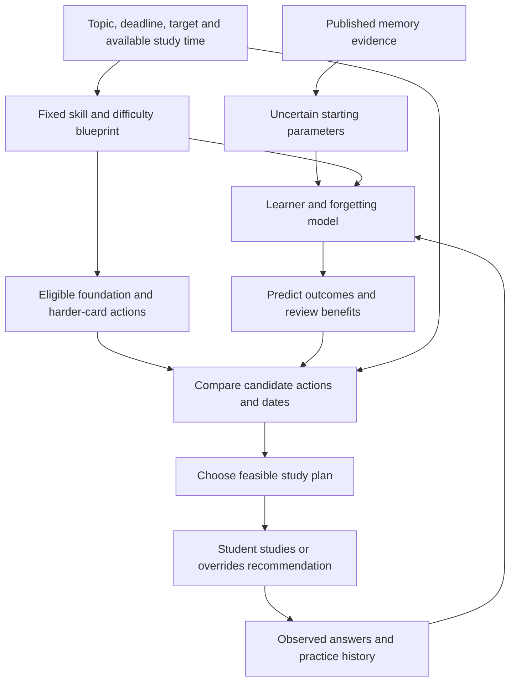

# Deadline Learning Model — Research Plan

Date: 7 October 2026
Status: Proposed research protocol; no experiment or implementation authorised by this document.
Scope: An independent learner model and deadline planner for Engram.
Evidence register: [Literature review](literature%20review.md), especially Sections 20–26.

## 1. Objective and definition of success

Develop and evaluate a system that chooses what a student should practise and when, aiming for a user-selected performance percentage on a representative set of topic cards by a user-selected deadline, within their available study time.

The percentage means expected scored performance on a fixed, versioned assessment blueprint covering the intended skills and difficulty levels. It is not a guarantee, a requested confidence level, or a prediction of an unseen external exam mark. Separate this deadline performance target from any per-card recall threshold used internally for scheduling.

Students may study across multiple decks and tests. Each goal has its own topic scope, deadline, target and time budget; shared skill evidence can inform multiple goals without counting the same attempt twice. Initial experiments should isolate one goal to make results interpretable.

Research success requires both useful calibrated forecasts and evidence that the chosen scheduling policy improves learning or efficiency. A model that predicts answers well does not necessarily choose beneficial review dates.

## 2. Research questions

1. Can practice history, elapsed time, skill and item difficulty predict performance at a future deadline better than simple baselines?
2. Can the model estimate the additional benefit of practising a particular item/skill on different feasible dates?
3. Under equal offered study-time budgets, does the deadline planner improve deadline assessment performance compared with ordinary spaced repetition?
4. Do forecasts remain calibrated near different selected targets, for new learners, and for different question types?
5. Does deadline-focused study preserve learning after the deadline?
6. How much data is needed before personalisation improves over shared population assumptions?

Progressive difficulty is part of the intended system. Hold the progression mechanism constant between scheduling groups initially; evaluate its separate contribution in a later study.

## 3. Working architecture

### Learner prediction

Start with a deliberately small, regularised model rather than a large neural network. Evaluate DAS3H as a skill-history predictor and an interpretable item-memory model such as half-life regression or activation-based modelling as comparators. Evaluate Dynamic Rasch/IRT for ability/difficulty calibration. These are candidate models, not an instruction to multiply their predictions or combine overlapping difficulty effects.

Use shared population parameters with learner/skill personalisation through partial pooling. Publication-informed priors express uncertain plausible starting behaviour; do not invent personally calibrated coefficients. Research on fact/vocabulary recall must not be treated as validated parameters for advanced mathematical procedures.

Select the predictor using future-data calibration and generalisation performance, not name recognition or fit on its training data. Maintain separate estimates for current knowledge, forgetting, practice benefit and response-time cost where identifiable.

### Progression

Represent reviewed prerequisite relationships and item difficulty. Recommend foundations first, then harder variants after varied, unaided and delayed evidence. Return to foundation repair when needed. Use soft recommendations initially; immediate repeated success is not sufficient evidence of durable mastery. The target assessment mix remains fixed even as practice difficulty changes.

### Action-effect model

The unresolved research component is the effect of a future practice action on later performance. Initial simulations may use literature-informed assumptions, clearly labelled uncertain. Learn action effects from controlled variation in feasible review windows and later outcomes. Observational practice coefficients alone cannot establish that moving a review causes an improvement.

### Planner

Implement an explainable greedy comparator using estimated deadline-performance gain per minute. Evaluate a bounded stochastic rollout/beam-search planner that compares candidate action/date sequences, branches over plausible outcomes and replans after observations. Reserve coverage and diagnostic checks rather than selecting only apparent immediate gains.

Prefer a lower-effort feasible plan predicted to reach the target. If none reaches it, return the best feasible forecast and explain the shortfall; do not silently lower the target or inflate mastery. Approximate search finds the best plan considered, not a proven globally optimal schedule.

## 4. Observation and data specification

For sample-size estimates, **one answer observation is one recorded answer attempt**. A 20-card session produces 20 attempts. Retesting those cards a week later produces another 20 linked attempts. Session starts, skipped cards and answer reveals are separate events, not automatically evidence of unaided recall.

| Data group | Required fields |
| --- | --- |
| Identity and content | Pseudonymous learner, goal, session, versioned item, variant family, skills, domain, question type, difficulty and scoring rubric |
| Timing | Answer timestamp, elapsed time since relevant practice, complete prior practice history, active response time and inactivity handling |
| Outcome | Correct/incorrect or rubric-based partial score, hints/reveals, assistance, self-rating, grading source/version and disputes/corrections |
| Planning | Deadline, target, offered time, recommended action/date, actual action/date, policy/model version and forecast issued before the outcome |
| Experiment | Assigned group/window, assignment probability where relevant, override/adherence, baseline knowledge, assessment identity and missing-follow-up reason if known |
| Operational context | Relevant interruptions or failures; distinguish model/service failure from learner failure |

Do not treat a skipped question or missing assessment as incorrect by default. Keep actual practice and formal assessment identifiable. Record question type for every supported type; begin with reliably scored types, then add partial-credit/AI-marked types after grading validation.

Use a shared reviewed skill blueprint and anchor items to help distinguish learner ability from item difficulty. Arbitrary personal decks with no overlap or skill mapping cannot identify all parameters reliably. Demographics are not required for the initial model; adding them would need a specific research hypothesis and separate justification.

## 5. Evidence and time horizons

Evaluate 1 day, 1 week, 1 month, 3 months, 6 months and 1 year. These are assessment horizons, not a universal review ladder. Track both the gap between study sessions and the interval from the last study session to assessment.

Initial development should concentrate on days/weeks and a roughly one-month deadline. Three-, six- and twelve-month extensions require actual corresponding follow-up. Record where literature only offers neighbouring intervals; never present interpolated three-month predictions as directly validated observations.

## 6. Study phases and decision gates

| Phase | Work | Evidence needed to advance |
| --- | --- | --- |
| A. Protocol and instrumentation | Define blueprint, scoring, consent, event schema, baselines and endpoints; verify logs on test data | Correct timestamps/history, stable scoring, reproducible forecasts and no future-data leakage |
| B. Natural-use pilot | Allow users to choose study times; gather repeated delayed attempts in a narrow domain | Sufficient delay/outcome diversity, acceptable missingness and useful preliminary forecasts |
| C. Prediction development | Fit simple models; compare population and personalised forecasts | Better held-out performance/calibration than declared baselines with uncertainty reported |
| D. Review-window experiment | Randomise reasonable recommended review windows for consenting participants; allow overrides | Evidence about practice effects and feasibility; adequate adherence and supported timing ranges |
| E. Deadline-policy trial | Compare frozen scheduling policies in a separate cohort | Primary endpoint meets prespecified criterion without unacceptable workload or retention trade-offs |
| F. Broader replication | Extend deadlines, domains and question types | Replicated performance and calibrated forecasts at each claimed horizon |

Phases B–D may reveal that a simpler model or planner is sufficient. Update the protocol prospectively and record decisions rather than continually adding complexity.

## 7. Natural-use pilot and sample size

A practical initial recruitment target is approximately 100 consenting learners contributing 100–200 informative answer attempts each: 10,000–20,000 observations. This is a feasibility budget, not a powered effectiveness claim. A smaller 50–100 learner pilot can establish instrumentation and adherence.

Later planning ranges are 50,000–200,000 attempts across roughly 300–1,000 learners for substantive evaluation, and substantially more for broad domain/type coverage. These are judgement-based ranges, not literature-established minimums. Repeated attempts are correlated; row count does not equal independent sample size.

Determine adequacy using model complexity, correctness frequency, learner/item coverage, time-gap diversity, held-out learning curves and uncertainty. Fit a separate confirmatory trial sample-size calculation using the minimum worthwhile assessment difference, pilot variance, assignment unit, clustering, power/significance choices and expected attrition. Set those values before confirmatory recruitment.

## 8. Experimental groups

### Timing/action-effect experiment

For consenting learners, assign a limited set of reasonable review windows within a supported range. Choose the exact windows from pilot evidence, feasibility and the deadline; no extreme deprivation intervals. Log the recommendation, random assignment and actual time. Allow overrides and evaluate assignment-based effects; adherence-sensitive estimates require stated causal assumptions.

Do not assume voluntary review times are random. Difficult material, motivation and prior knowledge can influence both timing and later outcomes. Natural-use data remains valuable for prediction, while the experiment improves identification of timing effects.

### Deadline-policy trial

| Group | Scheduling | Common conditions |
| --- | --- | --- |
| A | Ordinary FSRS with prospectively specified settings | Same content, interface, progression, grading, resources and offered time |
| B | Proposed deadline planner | Same conditions as A; timing/allocation policy differs |
| Optional C | Transparent deadline heuristic with coverage quotas and final reviews | Add only if recruitment supports a meaningful three-arm comparison |

Randomise learners within baseline-knowledge strata. Start with one domain and approximately one-month deadline; a common target simplifies the first trial, with custom targets evaluated in later cohorts or prespecified strata. If classroom/tutor influence creates contamination, consider classroom assignment and calculate the resulting clustered sample requirement.

Train on earlier cohorts, freeze shared model/policy versions for evaluation, and permit only the predefined individual-state updates during the trial. Avoid changing UI, grading and scheduling together. Prefer a two-arm study first rather than an underpowered full grid of targets, horizons and question types.

## 9. Assessments and outcomes

Use a baseline assessment, a deadline assessment and a prespecified delayed follow-up. Deadline questions should be unseen equivalent variants sampling the fixed blueprint, not whichever easy cards the planner selects. Use blinded grading where feasible and a stable rubric. Apply equal assessment exposure across groups because testing itself can affect later retention.

**Primary endpoint:** deadline assessment score under equal offered study-time budgets, adjusted as prespecified for baseline knowledge.

**Secondary endpoints:** proportion reaching target, forecast calibration near target levels, active study time, actual review count, delayed retention, advanced-skill coverage, adherence, dropout and grading reliability. Analyse scores and target attainment separately when targets differ.

Predictive metrics include log loss/Brier score for binary answers, suitable scoring rules for partial-credit outcomes, calibration curves and aggregate score error. Report confidence intervals and results by question type and horizon where samples support them. Prediction uncertainty is a research/reporting property, not an additional target the user must choose.

## 10. Analysis and safeguards against misleading results

- Use chronological evaluation and held-out learners. Add item/skill-held-out evaluation when claiming generalisation to new content.
- Keep future answers, later grades and post-outcome forecasts out of earlier prediction features.
- Account for responses nested in learners and items; use a prespecified mixed-effects or appropriate clustered analysis.
- Analyse randomised participants by assignment as the primary policy comparison. Report adherence and missing outcomes; prespecify missing-data and sensitivity analyses rather than reporting completers alone.
- Evaluate the frozen model in the new cohort. Do not use final assessments both to tune the model and claim independent performance.
- Compare planners in simulations with multiple learner dynamics, including models other than the planner's own simulator. Simulation results are not human efficacy evidence.
- Prespecify primary contrasts, meaningful effect and multiplicity handling. Distinguish exploratory findings from confirmatory tests.

## 11. Consent and research governance

Maintain the previously agreed separate opt-in for research metrics/outcomes and a separate opt-in for answer text/transcripts. Default research retention is 12 months and researcher access is limited to the project owner unless explicitly revised. Ensure the retention clock accommodates a one-year follow-up prospectively; do not silently extend consent or storage beyond the agreed policy.

Use pseudonymous research identifiers and restricted access. Do not collect unrelated personal content or raw audio for this study by default. Formal research recruitment, particularly involving minors, requires applicable ethics review and suitable consent arrangements before launch. Research participation must not be required for ordinary app use.

## 12. Novelty and intended contribution

Spaced review, personalised scheduling, future-test optimisation and multi-skill forgetting already have research precedents. The proposed contribution is a tested combination of customisable deadline targets, skill progression, time-constrained planning and calibrated performance on a fixed representative blueprint.

A new implementation alone does not establish a novel algorithm. Conduct a broader systematic novelty search and specify the precise gap before claiming priority. A useful empirical evaluation or published dataset/protocol can be a contribution even if the predictor uses existing algorithms.

## 13. Deliverables and unresolved decisions

Deliverables: evidence matrix; versioned protocol and data dictionary; consented pilot dataset; reproducible prediction benchmarks; action-effect estimates; frozen planner/baselines; preregistered trial analysis; results with limitations and replication plan.

Before recruitment resolve: initial domain/blueprint, grading method, common pilot target, available time budget, review-window choices, primary meaningful score difference, trial sample size, ethics route and long-term retention logistics. These are research-design decisions, not requests to make participants choose a confidence percentage.

No app code, backend schema, account data, experiments or installations are changed by creating this plan.

## 14. Key research anchors

See the literature review for detailed appraisal and limitations. These works inform ingredients; none validates the proposed combined Engram pipeline.

- [Cepeda et al. (2008): spacing and assessment horizon](https://files.eric.ed.gov/fulltext/ED505660.pdf).
- [Khajah et al. (2014): review planning for a future assessment](https://onlinelibrary.wiley.com/doi/10.1111/tops.12077).
- [Lindsey et al. (2014): personalised review in a classroom](https://journals.sagepub.com/doi/10.1177/0956797613504302).
- [Settles and Meeder (2016): trainable half-life regression](https://aclanthology.org/P16-1174/).
- [Choffin et al. (2019): DAS3H skill learning and forgetting](https://arxiv.org/abs/1905.06873).
- [Choffin et al. (2021): multi-skill spacing heuristics](https://jedm.educationaldatamining.org/index.php/JEDM/article/download/510/140).
- [Riley et al. (2020): context-specific prediction-model sample size](https://www.bmj.com/content/368/bmj.m441.abstract) — methodological context from clinical prediction, not an educational sample-size threshold.

## Implementation update — 7 October 2026

The first experimental baseline is implemented; see [implementation decisions](docs/DEADLINE-LEARNING-PROTOTYPE.md). It provides local notebook goals, independent provisional memory estimates, bounded greedy review planning, explicit planned-card study and notebook analytics. It is the simple baseline stage, not a validated learned action-effect model. Calibrated difficulty progression, beam search, research assignment and controlled efficacy trials remain planned research work.
