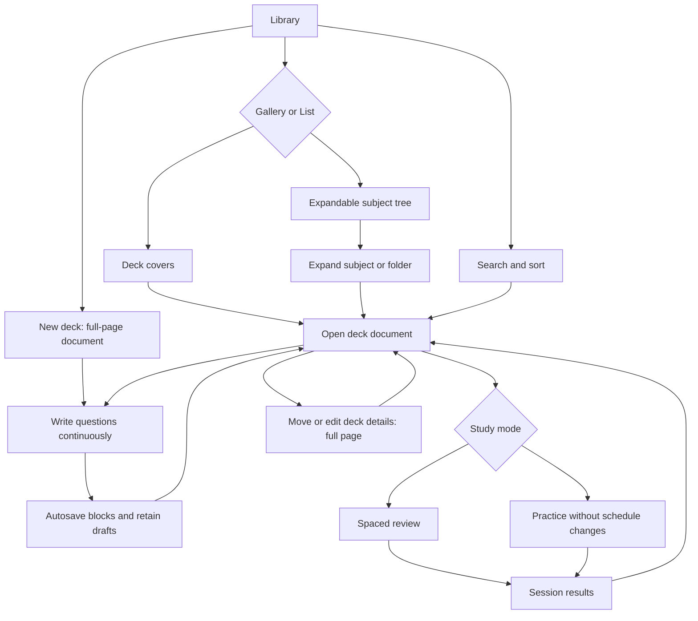
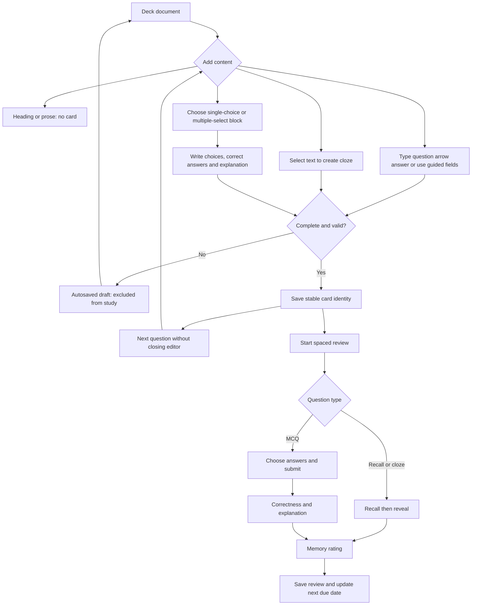

# iPhone Library: proposed product and workflows

Status: proposal for discussion, not an implementation commitment. Keep the current visual character; design iPhone first. No app code or library data changes belong to this planning step.

## Product thesis

Engram should feel like a notebook that turns what you write into a study queue. Library answers two questions immediately: "Where is my material?" and "What should I review next?"

Primary user: a learner collecting course material over time, writing many questions in one sitting, organizing several subjects, and returning for short daily study sessions.

Current friction: each question requires opening and dismissing an editor; the library emphasizes individual notes rather than an overview of decks. Multiple full-screen tasks are presented as bottom sheets. These are observations from the current source, not timed usability measurements.

## 1. Library landing page

- Keep the existing palette, type character, bottom navigation, and familiar toolbar styling.
- Show a left-aligned Library title, search, a compact Gallery/List control, a visible sort choice, and a clear New deck action.
- Gallery defaults to two columns on normal iPhone widths and one column for large accessibility text. Use compact deck-cover tiles, not a large padded panel around each tile.
- Each tile has a cover, deck title, subject path when relevant, card count, due count, and a readable next-review status. Do not rely on color alone.
- Covers can use a photo chosen through the system picker. Without one, generate a deterministic typographic cover from the deck name and a restrained accent color. This requires no AI, network, or hidden cost. Do not expose private answer text on covers by default.
- Tapping a deck opens its document page. Studying is an explicit action, never an accidental side effect of opening a deck.
- Search finds decks, subjects, and question text; a question result opens the matching block inside its deck. Show paths so identically named decks are distinguishable.
- Empty states provide Create a deck, Import, and optional sample material; no disabled mystery buttons.

## 2. Sorting

Default: Next review. Due/overdue decks first, ordered by earliest outstanding due time; new-only decks next; future reviews in chronological order; empty or fully suspended decks last. Use the deck name as a stable tie-breaker. Show daily-limit states explicitly, rather than pretending that every due card is immediately available.

Other sorts: A-Z/Z-A, Recently edited, Recently created, and Card count. Remember the user's choice. Refresh ordering on return or explicit refresh, not while a finger is about to tap a tile.

The current implementation actually sorts live decks alphabetically. Next review is a proposed change, not an existing behavior confirmed in the code.

## 3. Subjects, folders, and list view

Use one hierarchy: a Subject is a top-level organizational folder; it may contain folders and decks. A deck owns document blocks and study cards. Avoid overlapping "subject" and "folder" systems with different membership rules. A deck belongs in one place; tags can later support cross-subject classification without copying its cards.

Library offers Show folders. On, show the hierarchy. Off, show all decks in a flat gallery/list with their subject paths. This is a display preference: it does not move or delete content. Unfiled decks are allowed, so creating a subject is never a prerequisite for writing.

Example:

```text
Library
  AWS Cloud Practitioner
    Cloud Concepts
    Security & Compliance
    Technology & Services
      Compute
      Storage & Databases
    Billing & Support
  University
    Biology
  Unfiled decks
```

In list mode, subjects/folders have disclosure chevrons; decks have miniature covers and compact review counts. Expand/collapse in place, preserve expanded branches, and keep indentation modest. Sort siblings within each branch; a subject's next-review status summarizes its descendants. Gallery navigation uses a back button and breadcrumb. Multi-select plus a full-page Move destination picker supports bulk organization; drag-and-drop can be an optional shortcut, never the only way to move things.

## 4. A deck is a document

The deck page contains its editable name, optional cover, subject breadcrumb, card/due counts, Study action, and the document. Open in readable mode; tapping Edit or a block enters writing mode on the same page. Do not require a separate overview screen followed by another editor.

New deck opens a full-page document immediately with an optional title and a writing placeholder. A new deck created inside a subject inherits that location. A draft with content is retained even without a name. Leaving a completely untouched blank document creates no clutter.

Document blocks may be headings, prose, basic Q&A, reversed Q&A, cloze, single-choice MCQ, or multiple-select MCQ. Headings and prose do not silently become cards.

### Continuous writing

```text
# Key ideas
A short note to myself about this topic.

My question -> My answer
Another question -> Another answer
```

Recognize `->` on a completed line and convert it into an editable Q&A block. A subtle confirmation shows the card was added; Undo restores ordinary text. Support pasting several such lines. Enter advances to the next question; Shift-Enter adds a line within a field. On the software keyboard, a Next question accessory provides the same flow without requiring punctuation shortcuts.

A guided Q&A mode has question and answer fields in the document, with Next question immediately opening the next block. This is the same underlying document, not a second card database or a separate workflow requiring repeated sheets.

Keep unfinished blocks as drafts, excluded from study until valid. Show Saving, Saved, or a retryable save error. Expose draft counts and take the user to the unfinished block. Never silently discard text on Back.

Each card-producing block needs stable identity. Editing a question must not delete and recreate its study history; moving blocks must not alter scheduling. An explicit restart-learning action may be offered separately, not performed automatically on every edit. Undo and destructive changes must respect existing history.

## 5. Question types and study behavior

| Type | Writing | Study |
| --- | --- | --- |
| Basic Q&A | Question and answer | Recall, reveal, then rate |
| Reversed Q&A | One pair, two directions | Independently scheduled cards |
| Cloze | Select text and choose Hide | Fill the gap, reveal, then rate |
| Single-choice MCQ | Prompt, option rows, one correct answer, explanation | Select one, submit, see explanation |
| Multiple-select MCQ | Prompt, option rows, correct-answer toggles, explanation | Explicit Select N instruction, submit exact set |

Choose the block type through a small inline menu or keyboard toolbar. MCQ choices are edited inline; no modal per option. Require at least two nonempty choices, exactly one correct answer for single choice, and at least two correct answers plus one distractor for multiple select. Keep stable option IDs so shuffling does not corrupt the answer key. Never reveal the key before submission.

For spaced review, record objective MCQ correctness separately from a memory rating. A wrong submission defaults to Again; a correct one still allows a confidence rating so a lucky guess is not automatically Easy. Multiple-select uses exact-set correctness, with feedback about missing and extra choices. Practice mode is separate: show a score but do not change spaced-review due dates by default. Clearly label which mode the learner is entering.

## 6. Navigation policy

Library, subject/folder contents, deck document, deck details, moving decks, import review, study session, and results are full-page destinations. Use native Back navigation and preserve the previous scroll position. Settings may remain a sheet. Short contextual menus, system photo/file pickers, and destructive confirmation alerts remain appropriate; they are not substitutes for core pages. Focused writing and study can hide the bottom tab bar, restoring it when returning to Library.

## Main user flow



## Writing and review flow



## 7. AWS demo content

Use the supplied AWS Certified Cloud Practitioner Slides v44 PDF as private reference material for original practice questions. It has 516 pages and its outline covers cloud concepts, identity/security, compute, storage, networking, databases, billing, and related services. It carries a personal-use/non-distribution notice: do not bundle the PDF, slide images, copied practice questions, or long copied text with the app. Public release content needs an independent source/rights review and current AWS documentation checks.

Proposed preview build: a clearly labeled AWS Cloud Practitioner sample subject with around 40 original questions across representative topics and all supported question styles. Preload once into the user's development build after approval, never on every launch; use stable sample IDs, allow removal, and do not recreate a deleted sample. A released app should offer Add sample library rather than forcing it into everyone's library. No fabricated review history or scores.

The Luna sidecar returned a candidate outline and four sample questions, not a finished question bank. Its proposed 40-question mix is 10 basic recall, 10 cloze, 10 single-choice, and 10 multiple-select questions. Proposed decks: foundations/global infrastructure (4), IAM/shared responsibility (6), compute/scaling (6), storage (5), databases (5), networking (5), serverless/integration (4), and monitoring/billing/architecture (5). This is a UI demonstration mix, not a claim to reproduce exam domain weights. Sample questions still need independent fact-checking and editorial review before loading. No sample cards have been loaded into the app.

## Delivery sequence and decision

Recommendation: proceed with the direction, but approve and refine one page at a time.

1. Library gallery/list, review sorting, covers, and empty/populated states.
2. Subjects/folders and full-page deck navigation.
3. Document editor with continuous basic Q&A, paste, autosave, and draft recovery.
4. MCQ/multiple-select blocks and their review interaction.
5. Original AWS sample set and a walkthrough on the physical iPhone.
6. Adapt to Mac later; do not stretch the iPhone layout across a laptop window.

The current model has name-based nested decks (`::`) and basic/reversed/cloze notes. Covers, explicit subjects, document blocks, and MCQ answer sets require data-model and backup/import work, not only visual changes. Preserve IDs, reviews, and existing imported decks through migration. Do not claim lossless Anki export for new question types until a compatibility policy is designed.

Success criteria: writing ten consecutive questions without leaving the document; reopening with draft text intact; finding the next deck to study at a glance; switching gallery/list without changing organization; moving/editing a deck without resetting review history. These are proposed acceptance checks, not results of testing.

Non-goals for this first pass: recreating a full word processor, replicating VS Code on a phone, cloud sync, automatic PDF-to-deck generation, or redesigning every app page at once.
