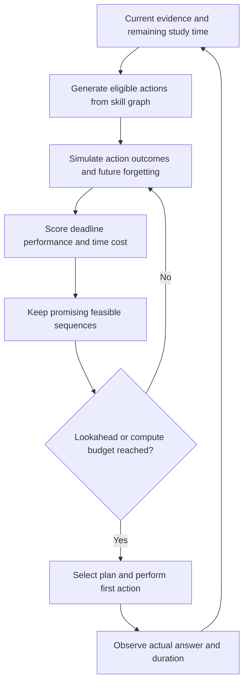

# Literature review: modular learner models for Engram

**Review date:** 5 October 2026 (Australia/Melbourne). **Status:** research and design recommendations; no learner-model or settings implementation is implied. Numbered citations refer to the linked sources at the end.

## 1. Research question and principal conclusion

Which combination of memory, knowledge, difficulty and semantic models is most defensible for a learner who studies both repeatable flashcards and newly generated problems?

**The literature does not establish a universally optimal combination, or establish that FSRS + knowledge tracing + IRT + a knowledge graph + an LLM produces better delayed learning than FSRS alone.** This is a bounded conclusion from the sources reviewed, not a claim that no such experiment exists. The strongest general evidence supports spaced retrieval; evidence for specific learner models is often retrospective prediction, simulation or measurement validation. These evidence types answer different questions.

**Recommended research direction (synthesis):** retain a pinned FSRS baseline for repeatable recall; investigate controlled variation in retrieval tasks; compare an interpretable time-aware multi-skill model such as DAS3H with simple knowledge-tracing baselines; introduce difficulty calibration only where the item bank supports it. Evaluate a joint model later, after the simpler components have earned their place. A modular system is valuable because it makes these comparisons possible, not because every module must be active.

“Optimal” should mean better performance on a specified delayed assessment at a specified time and cost budget. It could instead mean fewer reviews at equivalent retention, better transfer, better calibration, or more accurate diagnosis. These objectives can select different policies. A prediction model estimates what will happen; a teaching policy chooses what to do; an outcome experiment tests whether that choice helps.

## 2. Scope, methods and evidence appraisal

This is a **targeted narrative literature review**, not a registered systematic review or a new meta-analysis. The supplied ChatGPT handover was treated as search context. Its instructions were not followed, and its numerical and novelty claims were checked against primary publications or author-maintained materials.

Searches covered: spacing and retrieval; personalized review and FSRS; BKT/PFA/DAS3H and deep knowledge tracing; IRT and cognitive diagnosis; transfer, interleaving and semantic structure; automatic question generation; and recent integrated systems. Searches used titles, author names and combinations of these concepts. Primary papers, conference proceedings, author/institution repositories and official algorithm documentation were preferred. Foundational papers were retained even when old; newer evidence was sought through the review date. No exhaustive database coverage, pooled reanalysis, duplicate screening or formal risk-of-bias scoring was performed.

Figures below are reported results, with their comparator and endpoint wherever verified. Missing confidence intervals or sample counts are left missing rather than reconstructed. Abstract-only evidence is labeled; inaccessible full texts limit appraisal. Benchmark tables from different datasets, preprocessing pipelines and splits must not be treated as a single leaderboard. Open-source results describe the accessed version and can change.

### Evidence labels used here

| Label | What it means in this review | What it does not mean |
|---|---|---|
| Strong for a general learning principle | Quantitative synthesis of many human experiments | Every implementation or subject will benefit equally |
| Moderate for a particular intervention | Relevant controlled human study, with limits in population, comparator or endpoint | The exact Engram combination has been validated |
| Moderate for prediction/measurement | Real learner data, meaningful comparisons or an established measurement framework | A causal gain in retention or transfer |
| Preliminary | Simulation, preprint, small/domain-specific evaluation or insufficient independent validation | Ready for a “proven better” product claim |
| Unestablished for the proposed combination | No direct supporting comparison identified here | The combination cannot work |

These are editorial judgments, not GRADE ratings. Evidence strength is always attached to a claim and an outcome, not to an algorithm name alone.

## 3. What the current app models

Repository inspection at `d1783b8` found a card-level `FSRSScheduler` identified as `fsrs-6`, wrapping `swift-fsrs-4fbaf201`. It uses `FSRSDefaults.defaultWv6`; the adapter does not fit personalized parameters from the supplied review history. Settings constrain desired retention to 0.70–0.99, use short-term scheduling and fixed learning/relearning steps, and disable fuzz. Consequently, evidence about an optimized FSRS configuration is not automatically evidence about the shipped default-weight configuration.

The app already defines `Scheduler` and an optional `MemoryEstimating` capability, stores versioned scheduling state, and replays reviews with correction events. Research events include estimated recall, rating, question type, grading method, modality and duration. Those inspected fields do not provide a complete concept-level Q-matrix, calibrated item bank or experimental-assignment record.

Local evidence: [scheduler adapter](/Users/akshatporwal/Documents/projects/Memory/Sources/SchedulingAdapters/FSRSScheduler.swift), [contracts](/Users/akshatporwal/Documents/projects/Memory/Sources/LearningCore/Contracts.swift), [research event](/Users/akshatporwal/Documents/projects/Memory/Sources/LearningCore/ResearchEvent.swift), [review reconciliation](/Users/akshatporwal/Documents/projects/Memory/Sources/LearningCore/ReviewReconciliation.swift). These are code observations, not literature claims. No build or simulator run is needed for this document.

## 4. Distinguish the quantities being estimated

| Component | Useful question | Typical evidence | Boundary |
|---|---|---|---|
| Memory / scheduling | Will this learner retrieve this item after this delay? | Repeated item responses, elapsed time, review history | Card recall does not establish flexible application |
| Knowledge tracing (KT) | How does performance on a skill evolve with practice? | Chronological responses mapped to skills | “Mastery” is a model-defined latent estimate |
| IRT / multidimensional IRT | How does task difficulty relate to learner proficiency? | Responses to linked, calibrated items | A score requires an identified scale and appropriate model fit |
| Cognitive diagnosis (CDM) | Which required attributes are likely present or missing? | Diagnostic items and a validated Q-matrix | Wrong skill labels can produce misleading diagnoses |
| Semantic / prerequisite structure | Which tasks share skills, contexts or prerequisites? | Expert maps, task analysis, text features, learned relations | Text similarity is not proof of skill equivalence or transfer |
| Question-selection policy | Which task should be presented next? | Predictions, goals, time cost, coverage and uncertainty | Most accurate prediction need not yield best teaching |
| Generation and grading | Can a valid question and reliable assessment be produced? | Source material, rubrics, human audits, empirical responses | An LLM is not a calibrated learner model |

These are useful interface boundaries, not scientifically independent traits. KT can include forgetting and item difficulty; IRT can be dynamic; joint models can combine structure and time. Do not force overlapping models to pretend they estimate disjoint realities. [9–19, 23–25]

## 5. Memory, retrieval and scheduling

### 5.1 General principles are better established than specific algorithms

The spacing and retrieval literatures support repeated, separated retrieval as a foundation. Their pooled effects are not estimates of the benefit of FSRS over another spaced scheduler. The important comparison is often spaced versus massed practice, or retrieval versus restudy; Engram's baseline already incorporates both principles. [1–2]

Cepeda et al. synthesized **839 assessments from 317 experiments in 184 articles** on verbal recall. The best spacing depended on the final retention interval. Rowland's retrieval-versus-restudy meta-analysis synthesized **159 effect sizes from 61 studies**, with **Hedges' g=.50, 95% CI [.42, .58]**. This is a standardized difference, not a 50% improvement. [1–2]

### 5.2 HLR and personalized review

Half-Life Regression (HLR) models recall as a function of time and a learned memory half-life, with history and linguistic features. Its language-specific evaluation is useful evidence that personalization can improve forecasting; its figures should not be transferred to arbitrary problem solving or a different retention endpoint. [4]

Settles and Meeder evaluated **12.9 million student-word session traces**, with the first 90% for training and the final 10% for testing. Recall-rate MAE was **.128 for HLR**, **.235 for Leitner**, **.211 for logistic regression**, and **.175 for a constant baseline**. HLR's AUC was **.538**, versus Leitner's **.542**: better probability error did not imply better ranking. Deployment experiments measured engagement rather than delayed learning, and linguistic features raised generalization concerns. [4]

Personalized review has also been tested in human classrooms and large learning apps. Those interventions are more directly relevant to learning benefit than a scheduler prediction leaderboard, but neither establishes that all personalized algorithms are equivalent. [3, 7]

Lindsey et al. studied **179 middle-school Spanish learners over one semester**, comparing personalized DASH, generic spaced and massed review with equal review-trial counts. On an exam **28 days after the semester**, reported gains were **16.5% versus massed review (d=1.42)** and **10.0% versus generic spaced review (d=.88)**, both **p<.001**. These are the authors' reported percentage gains, not relabeled percentage-point differences. The design and population constrain generalization, and neither comparator was FSRS. [3]

### 5.3 FSRS: useful baseline, bounded evidence

FSRS uses difficulty, stability and retrievability to model repeated recall. The official algorithm documentation traces it to the DHP/DSR family. Version-specific formulas and fitted parameters matter. [6]

The accessed official SRS benchmark uses data from **10,000 Anki users, approximately 727 million reviews**. Its evaluation excluding same-day reviews contains **349,923,850 reviews**. Selected results below are means with **99% confidence intervals**, not participant learning effects. [5]

| Model / configuration | Log loss ↓ | RMSE in bins ↓ | AUC ↑ |
|---|---:|---:|---:|
| FSRS-6 | 0.3460 ± 0.0042 | 0.0653 ± 0.0011 | 0.7034 ± 0.0023 |
| FSRS-7, recency configuration | 0.3370 ± 0.0042 | 0.0593 ± 0.0010 | 0.7220 ± 0.0021 |
| Moving average | 0.3369 ± 0.0042 | 0.05915 ± 0.00082 | 0.7001 ± 0.0025 |

Most models use time-series splits; the repository notes a different training/evaluation arrangement for RWKV, so its headline ranking is not a fully matched comparison. These are logged responses under existing study behavior, not randomized outcomes under new scheduling policies. Close moving-average results reinforce checking metrics and baselines rather than claiming universal FSRS superiority. [5]

**Design inference:** retain Engram's exact FSRS-6 configuration as the reproducible control. Evaluate parameter fitting and version changes as separate treatments. A “newer scheduler” change and “new learner model” change should not be bundled if the experiment aims to attribute a benefit.

### 5.4 Optimal-control scheduling

MEMORIZE derives schedules under specified memory and review-cost assumptions; its 2019 evaluation includes a Duolingo natural experiment. Mathematical optimality is conditional on the model and objective, and observational agreement with a policy is not random assignment. [8]

The 2021 SELECT trial randomized approximately **50,700 consenting adult learners** in a German driving-theory app. The final publication reports **about 69% longer memory duration after controlling for study length and frequency**. The endpoint is estimated memory duration/half-life, not a 69-percentage-point increase in examination accuracy. The earlier preprint's approximately 67% figure should not replace the final article. Different comparisons and engagement outcomes vary; follow-up usage and dropout require attention. This is important human intervention evidence for data-driven session selection, but the comparator was heuristic sequencing, not Engram's FSRS or a validated transfer curriculum. [7]

**Assessment:** strong support for spaced retrieval in general; moderate, context-specific support for personalized practice policies; substantial retrospective evidence for FSRS recall forecasting; unestablished superiority of an FSRS-based modular stack on Engram learning outcomes.

## 6. Knowledge tracing and multi-skill learning

### 6.1 Interpretable baselines: BKT and PFA

Bayesian Knowledge Tracing (BKT) represents each skill as learned/unlearned, with parameters for initial knowledge, learning, guessing and slipping. Classical BKT does not include forgetting. The probability of being in the learned state is not the same as probability of a correct response. It is a useful interpretable baseline, particularly with curated skills, but a binary state need not capture partial understanding or flexible transfer. [9]

Performance Factors Analysis (PFA) uses skill-specific prior successes and failures to predict performance and accommodates multi-skill items. Plain cumulative counts do not encode actual elapsed-time forgetting. The source PDF was identified on the authors' institutional site, but its full text could not be fetched here; no exact performance advantage is asserted. [10]

An expanded BKT captured contextual and learner regularities and matched DKT in the experiments of Khajah et al. This does not make BKT universally competitive with every modern model, but demonstrates why a thoughtfully specified simple baseline matters. [13]

### 6.2 DAS3H: a particularly relevant candidate

DAS3H combines learner, item and skill effects with skill-specific practice history across **1-hour, 1-day, 7-day, 30-day and unbounded windows**. It directly addresses elapsed time and multi-skill practice. Five-fold student-level cross-validation produced the following AUCs (mean ± fold standard deviation; selected configurations from Tables 2–3). [11]

| Dataset | DAS3H | DASH | PFA | IRT |
|---|---:|---:|---:|---:|
| Algebra 2005–2006 | .826 ± .003, d=0 | .775 ± .005, d=5 | .744 ± .004, d=0 | .771 ± .007 |
| ASSISTments 2012–2013 | .744 ± .002, d=5 | .703 ± .002, d=0 | .669 ± .002, d=5 | .702 ± .001 |

Here `d` is embedding dimension. The original study did not compare DKT. The simple no-embedding DAS3H configuration won on Algebra. These results support testing a time-aware multi-skill predictor, not a claim that its scheduler improves retention by the AUC difference. [11]

**Design inference:** DAS3H is a promising first concept-level challenger, especially where many tasks reuse skills but individual generated questions rarely recur. Use it initially for shadow prediction or practice selection, with explicit ownership of any scheduling decisions that overlap FSRS.

### 6.3 Deep and attention-based models

DKT uses recurrent neural networks to summarize response sequences. Its historical results helped motivate deep KT; they do not establish a contemporary universal advantage or a causal learning improvement. [12]

AKT uses context-sensitive monotonic attention and Rasch-inspired embeddings. Contextual sequence distance should not automatically be interpreted as elapsed calendar time; Rasch-inspired representations are not automatically a calibrated assessment scale. [14]

The pyKT study used **20% held-out students**, five-fold training/validation on the remaining students, maximum training sequence length 200, and question-level aggregation of skill predictions. Table 2 reports: [15]

| Dataset | DKT AUC | AKT AUC | Absolute difference |
|---|---:|---:|---:|
| ASSISTments2009 | .7541 | .7853 | .0312 |
| Algebra2005 | .8149 | .8306 | .0157 |
| Bridge2006 | .8015 | .8208 | .0193 |
| NIPS34 | .7689 | .8033 | .0344 |

Its leakage demonstration inflated DKT skill-level AUC from **.7419 to .8262** on ASSISTments2009 and **.8146 to .9218** on Algebra. Expanding one question into skill records can expose its response before every prediction is made. Predict all required skills before updating from that answer. None of these AUCs measure teaching efficacy. [15]

simpleKT illustrates the value of a simpler neural comparator: NIPS34 AUC was **.8035** versus AKT's **.8033**, while AKT won on six of seven datasets in that study. Small differences can be outweighed by calibration, cost and operational simplicity. [16]

Recent leakage work continues to identify problems in multi-skill training and evaluation; preventing leakage only in the final test procedure is insufficient. [35]

**Assessment:** moderate evidence that several neural models improve next-response prediction on established datasets; insufficient direct evidence that choosing the highest AUC improves delayed retention or transfer in this application. Train/test separation must include question families and concepts where the intended deployment requires generalization to new material.

## 7. Ability, difficulty and diagnostic assessment

### 7.1 IRT and dynamic IRT

In a basic logistic IRT model, response probability depends on learner proficiency relative to item difficulty; richer models add discrimination, guessing, multiple dimensions or partial credit. The scale must be identified and its interpretation supported by item design and model fit. IRT is an established measurement framework, not a guarantee that adaptive instruction benefits learning. [23]

Dynamic IRT predates LLMs and explicitly models ability changing over repeated observations. Wang et al. use a state-space formulation, account for dependencies and uncertain difficulty, and demonstrate online/retrospective inference on reading-test data. This is a more appropriate conceptual alternative to treating a learner's ability as fixed throughout a course. [24]

**Design inference:** begin with a Rasch/1PL or hierarchical item-family model on a curated, linked bank. Move to 2PL, multidimensional or partial-credit models only if fit and available evidence justify the extra parameters. One uniquely generated question answered by one learner does not independently identify its difficulty, discrimination and that learner's proficiency. Reusable anchor items and pooled item families are therefore especially valuable.

### 7.2 Deep-IRT is integration prior art

Deep-IRT maps memory-network estimates into ability/difficulty terms through an IRT response function. On ASSIST2009, Table 2 reports AUC **81.65 ± .02** for Deep-IRT versus **81.61 ± .06** for DKVMN on a 0–100 scale: **.8165 versus .8161**. The AUC comparison has **p=.2581**. Its 30% sequence holdout and preprocessing differ from pyKT, so those tables cannot be directly ranked. The contribution is an interpretable output form with similar prediction in that comparison, not established superior learning or independent psychological validity of its latent ability. [17]

### 7.3 DINA and G-DINA

DINA is a diagnostic model in which an item requires a conjunction of designated attributes; guessing and slipping permit imperfect responses. It is most plausible for a curated diagnostic assessment with a defensible item-to-attribute Q-matrix. It does not by itself supply elapsed-time scheduling. [18]

G-DINA relaxes interaction restrictions and permits richer attribute-response relationships, at a higher calibration burden. Its foundational paper is **2011**, notwithstanding migrated publisher metadata. [19]

DINA identifiability depends on the structure of the Q-matrix and assessment design. A model can output clean-looking mastery probabilities without the data uniquely identifying them. [34]

**Design inference:** reserve CDMs for domains with explicit attributes and enough diagnostic coverage. Multi-step solutions and rubric dimensions may provide more useful diagnostic evidence than a single final-answer grade, but those dimensions need reliability studies. A Q-matrix generated by an LLM should remain a proposed mapping until checked.

### 7.4 Adaptive difficulty does not establish optimal teaching

A Dutch secondary-school randomized comparison found no average test-score advantage for adaptive over static practice. Static practice benefited higher-ability students by **0.08 standard deviations**; adaptive users received harder tasks, practiced longer and answered fewer correctly. Modest uptake and differences between the environments constrain interpretation, but the result challenges an automatic “adaptive is better” assumption. [32]

The “85% rule” derives approximately **15.87% optimal training error** under specified binary-classification and learning assumptions, demonstrated in artificial and biologically motivated network simulations. It is not a human trial establishing 85% as the universal success target for educational problem solving. [33]

**Design inference:** assessment and instruction need distinct difficulty policies. Items near maximum statistical information can be useful for estimating proficiency; instructional tasks may require scaffolding, feedback and successful retrieval. Treat difficulty bands as tunable experimental policies, not literature-proven universal settings.

## 8. Transfer, variation, interleaving and semantic structure

### 8.1 Retrieval can transfer, but the task matters

Pan and Rickard's meta-analysis covers **192 transfer effect sizes, 122 experiments, 67 articles and 10,382 participants**. Retrieval versus nontesting reexposure produced **d=.40, 95% CI [.31, .50]**. The result supports transfer from retrieval under studied conditions, with meaningful moderators. It does not measure the incremental benefit of an AI variation policy over fixed-card FSRS. [20]

Butler et al. tested genuinely different applications of concepts across **four experiments**, followed by a novel application test **two days later**. Pooled retrieval-condition performance was **.66 for variable examples versus .53 for the same example**, based on **793 versus 780 concept-within-participant observations**, not independent participants. Experiment 3 had **48 participants** and a variability effect **F(1,46)=6.14, p=.017, η²=.12**. This supports variation in application, with a short follow-up and narrow tasks; changing wording alone is not equivalent. [21]

### 8.2 Interleaving is a separate intervention

Rohrer et al.'s preregistered classroom cluster trial involved **787 grade-7 students in 54 classes**, comparing mostly interleaved with mostly blocked mathematics practice over four months. An unannounced test **one month later** yielded **61% versus 38%, d=.83**. The same problem types appeared in different orders. This supports practice that requires learners to select a strategy, but it is not a comparison against personalized FSRS and does not isolate within-concept semantic variation. [22]

**Design inference:** record whether a task changes surface context, representation, required inference, strategy selection or skill combination. A paraphrase, a new worked example, an interleaved problem and a far-transfer task should not all receive one “novel” label. Measure transfer with withheld tasks whose solution and assessment rubric were not used to train or tune the policy.

### 8.3 Graphs and joint models

PSI-KT is important prior art: a hierarchical generative model combining learner traits, temporal knowledge dynamics and prerequisite structure. The ICLR 2024 paper evaluates prediction on **three platform datasets**, including multi-step and continual-learning settings. It supports the feasibility of a joint structured model, not causal proof that inferred graph edges represent prerequisites or that its teaching policy improves learning. [25]

The LECTOR preprint reports **100 simulated learners, 100 days and 25 concepts per learner**. Table 1 gives success rates **.902 for LECTOR, .896 for FSRS and .884 for SSP-MMC**. Its FSRS difference is **0.6 percentage points**. Reported review attempts are **50,706 versus 151,848 versus 42,743**, respectively. These are simulator quantities, not human study outcomes. The abstract identifies SSP-MMC as the best baseline even though the results show higher FSRS success; algorithm comparability and simulator assumptions need scrutiny. Treat it as semantic-scheduling prior art, not validated superiority in learners. [30]

**Design inference:** embeddings can propose related content or detect duplicate questions; use curated mappings before automatically awarding credit to prerequisites or neighbors. A learner can solve an advanced task with a memorized pattern, a hint or compensation from another skill. Graph propagation should increase uncertainty-aware predictions only under a specified model, not silently manufacture direct evidence of mastery.

## 9. Generated questions, grading and AI tutoring

### 9.1 Generation quality and difficulty calibration

Law et al. compared **100 GPT-4o MCQs with 100 human MCQs**, tested by **24 emergency-medicine doctors**. Proportion correct was **.78±.22 versus .69±.23 (p<.01)**; discrimination was **.22±.23 versus .26±.26**. Factual errors were **6% versus 4%**, irrelevant items **6% versus 0%**, and inappropriate difficulty **14% versus 1%**. Reviewed creation took **24.5 versus 96 person-hours**. AI items were easier and included fewer application/analysis tasks. This small, domain-specific comparison supports reviewed generation and empirical validation, not instant calibrated question production. [26]

A 2026 preprint on reading/writing difficulty prediction reports best zero-shot GPT-4.1 **quadratic weighted κ=.578**, versus **.625 for ConvBERT**. Models struggled with hard items; semantic embeddings alone did not cleanly separate difficulty. Only the abstract was inspected here, and source metadata is inconsistent about the submission date, so this is preliminary supplementary evidence. It does not quantify the accuracy of every model or subject. [27]

**Design inference:** an “easy/medium/hard” generation prompt is a design target, not a calibrated difficulty estimate. Track template/item family, sources, answer key, rubric, concept map, requested difficulty, observed difficulty, revisions and generator version. Curated examples can precede LLM generation in an experiment, isolating whether variation helps before introducing generation errors.

### 9.2 Grading is a measurement layer

Henkel et al.'s accessible manuscript examines **1,710 short responses to 12 science/history questions**, marked by **38 teachers**. Few-shot GPT-4 agreement was **κ=.70**, versus human–human **κ=.75**. It focused on ambiguous answers after excluding null/exact exemplars. Agreement on a limited binary grading task does not validate rich concept-level inference. [36]

A contrasting study, published in 2026 after a 2025 preprint, examined **557 postgraduate medical answers from 215 students** on three ventilation cases. GPT-4o versus human grading had mean bias **−1.34 points out of 10**, **ICC1=.086**, and **κ=−.0786**. Internal consistency across AI runs did not imply agreement with humans. Different tasks and metrics prevent pooling these results with the prior study. [37]

**Design inference:** validate grading by question type and domain against adjudicated human rubrics. Distinguish incorrect, incomplete, hinted, ambiguous, ungraded and disputed responses. Do not convert every partial-credit value into an FSRS rating or skill success without a prespecified measurement rule. Corrections should replay affected estimates; confidence from the grader is not an empirically validated reliability score.

### 9.3 Tutor benefits do not validate a learner-model stack

Kestin et al.'s randomized crossover study included **194 Harvard physics students** over two lessons. Median post-test scores were **4.5 in AI observations versus 3.5 in classroom observations**; the reported standardized regression coefficient was **.63**. Median AI time was **49 minutes**, compared with an approximately 60-minute class. This supports a carefully designed pedagogical tutor on immediate learning, with limits in population, duration and setting. It does not establish long-term retention or FSRS integration benefits. [28]

Bastani et al.'s field experiment with **nearly 1,000 high-school learners** found assisted-practice relative improvements of **48% for GPT Base** and **127% for guarded GPT Tutor**. Subsequent unaided performance was **17% lower for GPT Base** than control; safeguards largely mitigated harm. These are relative changes, not percentage points. Assistance can improve task completion while weakening independent performance, so research assessments must remove the tutor. [29]

Onco-Shikshak's 2026 V7 design preprint integrates **FSRS v4, IRT, ACT-R-inspired activation, scaffolding, metacognition and AI workflows**. It describes **18 cases and six cancer types**, and explicitly says a learner randomized trial is planned. This is architecture prior art, not evidence of educational superiority. The older author-hosted v0 describes SM-2 and should not be substituted for the newer paper. Integration or generation alone is therefore an unsafe novelty claim. [31]

### 9.4 Laya as a local automatic-marking candidate

**Assessment added 5 October 2026:** Laya is a plausible experimental measurement component, separate from the memory/skill model. No direct validation of Laya on student-answer grading was identified in the sources inspected.

The official model card describes a **421M-parameter English encoder**, structured choice/ordinal-score/boolean outputs, and an approximately **808 MB checkpoint download**. Its reported single-question latency is **39.5 ms for English and 32.8 ms for multilingual on a Tesla T4**. These are not iPhone latency measurements. The English default budget is **512 tokens, with about 320 for the state**, limiting space for question, answer, reference and rubric. Its business-workflow benchmark reports **.362 accuracy for the base English model, .766 after task-specific fine-tuning, and .461 for the majority baseline**. Those results do not validate grading accuracy. [38]

The specialist checkpoint's card warns that it was trained on **four synthetic workflows**, may generalize poorly elsewhere, and requires confidence recalibration on held-out data. Its reproducible fine-tuning example takes **about 4–5 hours on two T4 GPUs**; that is not evidence that a quick educational fine-tune matches a stronger grader. [40]

The repository links an Apple-silicon runtime, but this review did not verify native iPhone execution or peak memory. Download/weight size is not total inference memory: activations, runtime buffers and other app models also contribute. A structured classifier avoids malformed generated prose, yet can still assign a confidently wrong mark. [39; design inference]

**Proposed evaluation:** retain deterministic checks for exact/numeric answers. Test Laya against the existing grader and adjudicated human labels on short factual responses and explicit rubric dimensions. Hold out whole question families; include paraphrases, negation, contradictions, partial answers, fluent wrong answers and unseen topics. Compare false acceptance, false rejection, ordinal agreement, calibration and the proportion safely auto-marked at a prespecified error tolerance. Measure memory, cold/warm latency and battery behavior on actual target devices before promising mobile performance. Use a separately validated fallback for ambiguous or complex reasoning; never multiply rubric-check probabilities as independent evidence. Run in shadow mode before it changes scheduling or mastery estimates.

**Research priority:** promising for local, low-latency marking; preliminary for educational accuracy and mobile deployment. Include base and education-fine-tuned variants as grading ablations, while keeping question selection and learner models fixed.

## 10. Comparing candidate combinations

The table is a research prioritization judgment, not a literature-derived performance ranking. “Moderate prediction evidence” does not upgrade an untested combination to “moderate learning evidence.”

| Candidate | What it offers | Supporting literature | Evidence for the exact combination | Main constraint | Priority |
|---|---|---|---|---|---|
| Pinned FSRS-6, fixed recall tasks | Reproducible item-retention control | Spacing/retrieval; official recall benchmark [1–6] | Engram learning benefit not directly measured | Defaults differ from fitted configurations; no transfer estimate | Essential baseline |
| FSRS + curated varied applications | Retention scheduling plus broader retrieval contexts | Human variation and transfer studies [20–21] | Unestablished versus FSRS alone | Novel tasks need separate evidence rules; preserve dose | First learning-outcome experiment |
| FSRS + interpretable BKT/PFA | Recall plus skill-performance tracking | Classic and extended baselines [9–10, 13] | Unestablished | Forgetting, item effects and skill labels need explicit treatment | Low-complexity comparator |
| FSRS + DAS3H | Item memory plus time-aware multi-skill predictions | DAS3H offline evaluations [11] | Unestablished | Overlapping memory predictions; skill mapping and training | First model challenger |
| FSRS + calibrated IRT difficulty | Recall timing plus linked difficulty/proficiency estimates | Measurement/dynamic modeling [23–24] | Unestablished | Shared anchors and item calibration; instructional policy separate | After bank validation |
| FSRS + DINA/G-DINA diagnostics | Recall plus attribute-level diagnostic profile | CDM theory and identifiability [18–19, 34] | Unestablished | Curated Q-matrix and diagnostic coverage | Domain-specific track |
| FSRS + AKT/simpleKT or Deep-IRT | Flexible response prediction | Reproducible deep-KT comparisons [14–17] | Unestablished | Data, calibration, portability and explainability | Offline challenger first |
| Joint graph/time model, e.g. PSI-KT | Unified temporal/structural inference | Joint model evaluation [25] | Unestablished in Engram | Learned relations and model fit need validation | Later research track |
| Full FSRS + KT + IRT + graph + LLM | Broad adaptive teaching loop | Components and integration prior art [11, 17, 25–31] | Unestablished | Attribution, identifiability, grading noise and cost | Defer until ablations justify it |

### Proposed settings summary

This is copy/design guidance for a future settings screen; no screen has been implemented. Prefer understandable presets over unrestricted combinations that cannot be validated together.

| User-facing option | Plain-language summary | Literature strength shown | Availability rule |
|---|---|---|---|
| Recall practice | Schedules repeatable questions using your review history | Strong evidence for spaced retrieval; scheduler evidence is prediction-based | Default baseline |
| Varied application practice | Adds different examples of the concepts you study | Controlled studies support varied applications; this combination remains experimental | Reviewed task families available |
| Skill-aware practice | Uses performance across related questions to estimate skills | Moderate evidence for predicting responses; learning gains still under study | Sufficient skill-tagged data |
| Calibrated difficulty | Selects from questions with measured difficulty | Established assessment framework; adaptive learning benefit depends on policy | Linked item bank available |
| Diagnostic assessment | Estimates specific strengths and gaps | Established model family; validity depends on assessment design | Validated diagnostic domain |
| Research models | Tests newer neural or graph models | Prediction/simulation evidence; outcomes not yet established | Explicit research configuration |

Show the **goal, model version, data readiness, uncertainty, evidence type, expected workload and whether AI is required**. Avoid “best model,” “proven mastery” or a universal percentage learning improvement. Give evidence details on demand, including population, comparator and follow-up. If the user's library lacks calibrated items or skill coverage, say “not enough evidence yet” rather than displaying precise mastery scores.

Self-selected presets are useful product choices, but comparing their users observationally will be confounded by motivation, subject and prior proficiency. Product choice and randomized research assignment should be represented separately.

## 11. Handling shared evidence without double counting

The handover identifies a real risk but overstates it if interpreted as “one answer may update only one model.” **Several models may legitimately consume the same observation.** The problem occurs when their derived estimates are fused as if they were independent evidence, or repeated processing counts one event more than once.

**Proposed design, not an empirically validated architecture:**

1. Store one immutable attempt identifier, item/family version, timestamp, skill map, assistance status and assessment version.
2. Produce all pre-response predictions before any component sees the response.
3. Record the observed answer and measurement uncertainty separately from model estimates.
4. Let shadow models update once each from the event, retaining distinct outputs and uncertainty.
5. Give one specified policy responsibility for the actual selection/scheduling decision. Do not average recall, mastery and ability percentages.
6. For a joint model, use one response likelihood conditioned on its latent states. Do not multiply FSRS, KT and IRT predictions as independent observations of the same answer.
7. Use corrections to invalidate/replay derived updates; preserve original predictions for honest retrospective evaluation.

A correct unassisted repeated recall answer can inform item memory. A novel application answer can inform skill performance, conditional on item demands. Hinted completion, source lookup, transcription uncertainty and unverified grades require different rules. Evidence about a multi-skill final answer is not proof that every component skill has been mastered. If FSRS is extended from cards to concepts, that extension becomes a new modeling hypothesis to validate.

## 12. Research program to identify the best combination

The following is a proposed study program. Its timings, thresholds and analysis choices are suggestions requiring domain-specific piloting, not values established by the literature.

### Stage A: measurement and offline validation

Create a small curated bank with explicit concepts, matched task families, rubrics and reusable anchors. Check question accuracy, mapping agreement and grading reliability before judging a learner model. Evaluate defaults versus fitted parameters separately.

Compare simple empirical baselines, pinned FSRS, BKT/PFA and DAS3H. Add AKT/simpleKT only once enough representative history exists. Use chronological evaluation; separately test new learners, new items/families and new concepts. Group multi-skill records from the same attempt. Train feature extraction, calibration and hyperparameter selection without future/test evidence. Log predictions before the response is graded. The leakage demonstrations make this separation essential. [15, 35]

Report log loss, Brier score, calibration plots/slope/intercept, AUC, uncertainty coverage where defined, and computational cost. Stratify by domain, delay, task type, assistance, input modality and history length. Report cluster-aware uncertainty rather than treating every review as an independent participant. A model advancing to the next stage should show a useful improvement under the deployment split, not merely a significant result on millions of correlated observations.

### Stage B: isolate task variation

Compare **A: fixed retrieval + pinned FSRS** with **B: curated varied retrieval + the same retention control and matched exposure budget**. Prespecify how application attempts affect recall scheduling; keep grading and feedback comparable. If isolating variation proves impossible without changing the scheduling policy, describe the experiment as a package comparison.

Primary outcome: unassisted delayed performance on withheld tasks. Suggested follow-ups are 7 and 30 days, adjusted to the educational goal. Measure fixed-item recall and new-example application separately. Include a prespecified farther-transfer outcome where a credible task can be designed. Avoid using AI-generated grading as the only outcome measure when the intervention itself changes AI question generation.

### Stage C: test adaptation rather than merely estimation

Compare B with **C: varied retrieval selected using an interpretable skill model**. Then compare C with **D: skill-aware selection plus empirically calibrated difficulty**. Keep sources, tutor availability and grading constant where possible. A factorial design can test interactions if adequately powered; otherwise a smaller staged design will be easier to interpret.

For efficiency, compare retained knowledge at a fixed study-time budget, or study time/reviews needed to reach a prespecified retention target. Count feedback, hints, retries and grading time. If reviews are reduced, establish an acceptable retention/transfer noninferiority margin before data collection; fewer reviews alone is not success.

### Stage D: joint and neural policies

Only after C or D improves outcomes should a full joint/graph or neural policy be compared with the best simpler policy. Include ablations that remove time awareness, difficulty, graph propagation and novelty selection where their effects remain unresolved. A larger stack beating basic FSRS does not show which component caused the gain.

### Design and analysis safeguards

Within-person assignment of matched concept sets can control stable learner differences, but related concepts may contaminate each other through transfer. Use sufficiently separated concept clusters, counterbalancing and participant/item effects; consider learner/class-level assignment when tutor behavior or prerequisite learning crosses conditions. Immediate crossover is poor protection when learning carries over permanently.

Do not choose a sample size from an unrelated paper's standardized effect. Estimate plausible item/learner/class variance, repeated-measure correlation, minimum educationally meaningful difference, allocation and dropout; then simulate power for the actual mixed or clustered design. Preregister a primary endpoint, multiplicity strategy, intention-to-treat analysis and sensitivity analyses for missing follow-ups. Retain assignment and exposure records even for learners who stop practicing.

Keep learning outcomes separate from engagement. Delayed recall, transfer, calibration and learning per minute are research outcomes; session completion, return rate, latency, AI cost and grading disputes are product outcomes. Report both when relevant, without replacing one with the other.

## 13. Remaining gaps and decision

The unresolved questions are substantive: whether concept-level evidence generalizes across question families; whether generation reliably targets difficulty; whether noisy grades distort inferred skills; whether semantic relations predict transfer; and whether model-informed selection improves unassisted delayed performance over a strong spaced-retrieval baseline.

This review supports **modularity for comparison, reproducibility and uncertainty**, with a restrained initial set of candidates. It does not support giving every user unrestricted algorithm combinations or describing a particular stack as optimal. The highest-priority experiment is controlled variation with the current FSRS baseline; the highest-priority additional predictor is an interpretable time-aware multi-skill model. Difficulty and diagnostic models become more useful as the item bank and measurement design mature.

## 14. Numbered sources

Links point to primary publications, author/institution manuscripts or official technical materials. Some full-text fetches were unavailable; abstract-only or limited-access use is noted in the relevant discussion. “Preprint” and “benchmark” are not peer-reviewed learning trials.

1. Cepeda et al. (2006). *Distributed practice in verbal recall tasks: A review and quantitative synthesis.* [Publication record](https://pubmed.ncbi.nlm.nih.gov/16719566/); [full text](https://www.escholarship.org/content/qt3rr6q10c/qt3rr6q10c.pdf).
2. Rowland (2014). *The effect of testing versus restudy on retention: A meta-analytic review of the testing effect.* [Publication record](https://pubmed.ncbi.nlm.nih.gov/25150680/); [DOI](https://doi.org/10.1037/a0037559).
3. Lindsey et al. (2014). *Improving Students' Long-Term Knowledge Retention Through Personalized Review.* [Author-hosted published PDF](https://home.cs.colorado.edu/~mozer/Research/Selected%20Publications/reprints/LindseyShroyerPashlerMozer2014Published.pdf); [DOI](https://doi.org/10.1177/0956797613504302).
4. Settles & Meeder (2016). *A Trainable Spaced Repetition Model for Language Learning.* [ACL paper and PDF](https://aclanthology.org/P16-1174/).
5. Open Spaced Repetition. *SRS benchmark.* [Official repository](https://github.com/open-spaced-repetition/srs-benchmark); [snapshot at review](https://github.com/open-spaced-repetition/srs-benchmark/tree/bd9110f791e5b37282c55a9aa8db35f68f0c4aa2). Live developer-maintained benchmark; accessed 5 October 2026.
6. Open Spaced Repetition. *The Algorithm.* [Official FSRS documentation](https://github.com/open-spaced-repetition/awesome-fsrs/wiki/The-Algorithm). Technical documentation; accessed 5 October 2026.
7. Upadhyay et al. (2021). *Large-scale randomized experiments reveals that machine learning-based instruction helps people memorize more effectively.* [Published article](https://www.nature.com/articles/s41539-021-00105-8); [institution-hosted final PDF](https://pure.mpg.de/pubman/item/item_3658215_2/component/file_3658216/s41539-021-00105-8.pdf).
8. Tabibian et al. (2019). *Enhancing human learning via spaced repetition optimization.* [Published article](https://doi.org/10.1073/pnas.1815156116); [full text](https://pmc.ncbi.nlm.nih.gov/articles/PMC6410796/).
9. Corbett & Anderson (1995). *Knowledge tracing: Modeling the acquisition of procedural knowledge.* [Published article](https://doi.org/10.1007/BF01099821).
10. Pavlik, Cen & Koedinger (2009). *Performance Factors Analysis—A New Alternative to Knowledge Tracing.* [Institution-hosted PDF](https://pact.cs.cmu.edu/pubs/AIED%202009%20final%20Pavlik%20Cen%20Keodinger%20corrected.pdf). Full fetch unavailable during this review.
11. Choffin et al. (2019). *DAS3H: Modeling Student Learning and Forgetting for Optimally Scheduling Distributed Practice of Skills.* [Full text](https://arxiv.org/html/1905.06873); [record](https://arxiv.org/abs/1905.06873). EDM paper.
12. Piech et al. (2015). *Deep Knowledge Tracing.* [NeurIPS paper](https://papers.nips.cc/paper_files/paper/2015/file/bac9162b47c56fc8a4d2a519803d51b3-Paper.pdf).
13. Khajah, Lindsey & Mozer (2016). *How deep is knowledge tracing?* [Author manuscript](https://arxiv.org/abs/1604.02416).
14. Ghosh, Heffernan & Lan (2020). *Context-Aware Attentive Knowledge Tracing.* [Author manuscript](https://arxiv.org/abs/2007.12324); [author-hosted KDD PDF](https://people.umass.edu/~andrewlan/papers/20kdd-akt.pdf).
15. Liu et al. (2022). *pyKT: A Python Library to Benchmark Deep Learning based Knowledge Tracing Models.* [NeurIPS paper](https://papers.neurips.cc/paper_files/paper/2022/file/75ca2b23d9794f02a92449af65a57556-Paper-Datasets_and_Benchmarks.pdf).
16. Liu et al. (2023). *simpleKT: A Simple But Tough-to-Beat Baseline for Knowledge Tracing.* [Full text](https://arxiv.org/html/2302.06881).
17. Yeung (2019). *Deep-IRT: Make Deep Learning Based Knowledge Tracing Explainable Using Item Response Theory.* [Primary manuscript](https://arxiv.org/pdf/1904.11738).
18. Junker & Sijtsma (2001). *Cognitive Assessment Models with Few Assumptions, and Connections with Nonparametric Item Response Theory.* [Institution-hosted paper](https://research.tilburguniversity.edu/files/437495/cognitive.pdf).
19. de la Torre (2011). *The Generalized DINA Model Framework.* [Published article](https://doi.org/10.1007/s11336-011-9207-7).
20. Pan & Rickard (2018). *Transfer of Test-Enhanced Learning: Meta-Analytic Review and Synthesis.* [Published article](https://doi.org/10.1037/bul0000151); [paper PDF](https://pdf.retrievalpractice.org/transfer/Pan_Rickard_2018.pdf).
21. Butler, Black-Maier, Raley & Marsh (2017). *Retrieving and Applying Knowledge to Different Examples Promotes Transfer of Learning.* [Published article](https://doi.org/10.1037/xap0000142).
22. Rohrer, Dedrick, Hartwig & Cheung (2020; online 2019). *A randomized controlled trial of interleaved mathematics practice.* [Published article](https://doi.org/10.1037/edu0000367); [funded study details](https://ies.ed.gov/use-work/awards/efficacy-study-interleaved-mathematics-practice).
23. Chen, Li, Liu & Ying (2021 manuscript). *Item Response Theory—A Statistical Framework for Educational and Psychological Measurement.* [Primary authors' review](https://arxiv.org/abs/2108.08604).
24. Wang, Berger & Burdick (2013). *Bayesian analysis of dynamic item response models in educational testing.* [Published article](https://doi.org/10.1214/12-AOAS608); [author manuscript](https://arxiv.org/abs/1304.4441).
25. Zhou et al. (2024). *Predictive, scalable and interpretable knowledge tracing on structured domains.* [ICLR paper](https://proceedings.iclr.cc/paper_files/paper/2024/file/99238c9d7ad8c6d138dc417fd8e3740c-Paper-Conference.pdf); [author manuscript](https://arxiv.org/abs/2403.13179).
26. Law et al. (2025). *AI versus human-generated multiple-choice questions for medical education: a cohort study in a high-stakes examination.* [Primary published study](https://doi.org/10.1186/s12909-025-06796-6).
27. Wang et al. (2026). *Can LLMs Really Understand Item Difficulty Levels? Implications for Automated Item Generation Using LLMs.* [Preprint](https://arxiv.org/abs/2607.28634). Abstract-only use; date metadata discrepancy.
28. Kestin et al. (2025). *AI tutoring outperforms in-class active learning: an RCT introducing a novel research-based design in an authentic educational setting.* [Primary published trial](https://doi.org/10.1038/s41598-025-97652-6).
29. Bastani et al. (2025). *Generative AI without guardrails can harm learning.* [Published article](https://doi.org/10.1073/pnas.2422633122); [author manuscript](https://hamsabastani.github.io/education_llm.pdf).
30. Zhao (2025). *LECTOR: LLM-Enhanced Concept-based Test-Oriented Repetition for Adaptive Spaced Learning.* [Primary preprint full text](https://arxiv.org/html/2508.03275v1); [record](https://arxiv.org/abs/2508.03275).
31. Makani (2026). Onco-Shikshak V7 design. [Primary medRxiv preprint](https://www.medrxiv.org/content/10.64898/2026.02.23.26346944v1.full).
32. van Klaveren, Vonk & Cornelisz (2017). *The effect of adaptive versus static practicing on student learning—evidence from a randomized field experiment.* [Published article](https://doi.org/10.1016/j.econedurev.2017.04.003); [institution record](https://research.vu.nl/en/publications/the-effect-of-adaptive-versus-static-practicing-on-student-learni/).
33. Wilson et al. (2019). *The Eighty Five Percent Rule for optimal learning.* [Published article](https://doi.org/10.1038/s41467-019-12552-4); [publication record](https://pubmed.ncbi.nlm.nih.gov/31690723/).
34. Gu & Xu (2019). *The Sufficient and Necessary Condition for the Identifiability and Estimability of the DINA Model.* [Published article](https://doi.org/10.1007/s11336-018-9619-8); [author manuscript](https://arxiv.org/abs/1711.03174).
35. Badran & Preisach (2025). *Addressing Label Leakage in Knowledge Tracing Models.* [Primary manuscript](https://arxiv.org/abs/2403.15304); [CSEDU paper](https://doi.org/10.5220/0013275200003932).
36. Henkel et al. (2024). *Can Large Language Models Make the Grade? An Empirical Study Evaluating LLMs Ability to Mark Short Answer Questions in K-12 Education.* [Primary accessible manuscript](https://arxiv.org/abs/2405.02985); [PDF](https://arxiv.org/pdf/2405.02985).
37. Jade & Yartsev (2026). *ChatGPT for automated grading of short-answer questions in mechanical ventilation examinations.* [Published study](https://doi.org/10.11157/fohpe-vol27iss1id958); [2025 primary preprint](https://arxiv.org/abs/2505.04645).
38. Convai Innovations. *Laya model card.* [Official checkpoint documentation and benchmarks](https://huggingface.co/convaiinnovations/laya). Developer-reported technical evidence; accessed 5 October 2026.
39. Convai Innovations / NandhaKishorM. *Laya runtime repository.* [Official implementation and linked deployment projects](https://github.com/NandhaKishorM/laya). Technical evidence; accessed 5 October 2026.
40. Convai Innovations. *Laya typed-decisions model card.* [Training, evaluation and calibration limits](https://huggingface.co/convaiinnovations/laya-typed-decisions). Synthetic-workflow evidence; accessed 5 October 2026.

---

## 15. Deadline-aware study planning: research extension

**Added:** 7 October 2026 (Australia/Melbourne). **Scope:** targeted narrative review of algorithms for a fixed examination horizon, constrained study time, and the balance between initial learning and review. This section is research and proposed design, not an implementation or a claim of guaranteed exam readiness. Sections 1–14 are preserved from the existing main-branch literature review; their historical descriptions retain their original review date. This file was absent from the learning-models checkout, so that existing review was restored here before appending this extension. References D1–D12 below are independent of the original 1–40 numbering.

### 15.1 Principal conclusion

A deadline-aware plan should optimize an explicitly defined outcome at the exam date, under the learner's available study budget. Maintaining a recall threshold throughout the semester is a different objective. The evidence reviewed does not identify one universally superior, production-ready algorithm for all subjects and deadlines.

The closest directly relevant established work is **memory-model simulation plus schedule search for a specified final test** (D1). Human classroom research supports personalized review (D3), but does not validate Engram's proposed combination. Recent model predictive control work provides a promising finite-horizon scheduling approach in a different training domain (D10). Multi-skill scheduling research helps extend planning beyond repeating identical cards (D6–D7). Other important algorithms optimize continuous retention or memorization cost and must not be described as exam optimizers merely because they simulate a finite period (D4–D5, D11).

**Recommendation — our synthesis:** retain FSRS for supported repeated-card memory estimates and compare a transparent deadline-aware marginal-gain planner against a bounded multi-step rollout planner. Use the learner-model modules only where their question mappings and calibration are valid. Introduce reinforcement learning later as an experimental comparator, rather than the first default.

### 15.2 Search and appraisal

Searches combined spaced repetition, examination deadline, finite horizon, optimal control, model predictive control, final-test retention, adaptive review, multi-skill practice and reinforcement learning. Primary papers, author/institution manuscripts, proceedings and official implementation documentation were used. Blog advice and forum discussion were not treated as efficacy evidence. This was not an exhaustive systematic search, and no pooled effect estimate was produced.

Full text was inspected for D1, D4, D6–D8; institutional/publisher materials were consulted for D2–D3. D9 is assessed from the proceedings abstract; D10 from its indexed abstract/publisher excerpts, with full methods not appraised. D5 and D11 are assessed here principally through official algorithm/implementation materials. D12 is a feature request, not research. Search crawl dates were not used as publication dates. Dynamic repository details are observations as accessed on this review date and need version verification before adoption.

### 15.3 What should be optimized?

A useful proposed objective is:

    Expected weighted score on an independent assessment at deadline T
    minus study-cost and workload penalties
    subject to daily time limits, permitted study days, and content availability.

For a fixed-card assessment, the score term can be `sum_i w_i * P(correct_i at T | observed history, planned actions)`. For an exam with unseen questions, it should instead average predictions over a representative distribution of skill combinations and question formats. Card recall and unseen-question success must remain separate outputs.

Weights should come from a supplied syllabus, teacher priorities or explicit learner choices. Do not invent exam weighting. Hard time constraints and minimum coverage constraints may be more appropriate than penalties alone. A forecast can indicate that a target is infeasible; it cannot promise a pass.

### 15.4 Algorithms and evidence

| Candidate | Actual objective or contribution | Deadline relevance | Evidence and limit |
|---|---|---|---|
| ACT-R/MCM schedule search (D1) | Compare schedules by final-test recall | Direct | Model-based simulations, not a new learner trial |
| Personalized DASH review (D3) | Adapt review to estimated individual memory | Supporting | Classroom exam outcomes; limited domain |
| Memorize (D4) | Balance forgetting loss and review intensity | Requires adaptation | Theory, simulation and observational logs |
| SSP-MMC (D5) | Reduce cost of attaining long-term memory | Requires different terminal goal | Official implementation; not an exam guarantee |
| DAS3H and multi-skill heuristics (D6–D7) | Predict skill performance; select useful skill combinations | Useful planning components | Prediction and synthetic policy evaluation |
| DeepTutor / TADS (D8–D9) | Learn next-content policies from study history and timing | Experimental comparator | Simulation/environment evaluations |
| Finite-horizon MPC (D10) | Re-estimate state and optimize upcoming task sequence | Close architectural match | Different training domain; limited appraisal |
| FSRS / Cost ADR (D11) | Recall prediction, intervals and cost-conditioned retention | Baseline/model component | Official code; not native deadline proof |

#### D1 — ACT-R/MCM final-test schedule optimization

Khajah, Lindsey and Mozer (2014) simulate a semester's material using two memory models and compare review schedules against exhaustive-search optima for specified retention intervals. They also examine threshold and fixed-lag heuristics. This is directly relevant to choosing review actions for a future test rather than choosing the next interval in isolation. [Paper](https://onlinelibrary.wiley.com/doi/10.1111/tops.12077)

The exhaustive search is tractable in the paper's constrained schedule space, not arbitrary large libraries. Scheduling and simulated learners use the same model, giving favorable model knowledge. Its near-optimal threshold results and particular threshold settings are not universal settings for FSRS or maths mastery. **Engram inference:** use small exact searches as test oracles; use approximate search for realistic libraries.

#### D2 — Spacing depends on the final test delay

Cepeda et al. (2008) experimentally vary the interval between learning and a later review, and the delay from that review to the final test. The best gap changes with the retention horizon; longer spacing is not always better. This supports making the exam horizon explicit. [Institutional manuscript and abstract](https://escholarship.org/uc/item/0kp5q19x)

The experiment does not supply a complete adaptive, multi-review, multi-subject planning algorithm. In particular, reported gap-to-test-delay ratios must not become a universal rule that every student reviews exactly a fixed percentage of the remaining days before an exam.

#### D3 — Human evidence for personalized review

Lindsey et al. (2014) deploy personalized review using difficulty, ability and study history in a middle-school foreign-language course and compare time-matched review conditions on cumulative exams. The study supports personalized review as a meaningful intervention, beyond predicting individual answers. [Published study](https://journals.sagepub.com/doi/pdf/10.1177/0956797613504302)

It does not establish that a new deadline planner beats modern FSRS, or generalizes to all mathematical, essay or programming examinations. Treat its exam outcomes as supporting evidence for adaptation, not a promised percentage improvement for Engram users.

#### D4 — Memorize: stochastic optimal control

Tabibian et al. (2019; earlier manuscript 2017) formulate reviewing through stochastic optimal control. Under their specified quadratic loss, the derived review intensity increases with forgetting probability, with a cost parameter controlling effort. The formulation includes terminal cost, but that does not make the reported closed-form policy valid for an arbitrary exam-day objective. [Primary full text](https://arxiv.org/html/1712.01856)

The reviewed real-data evaluation is observational; it is not a randomized exam intervention. The loss penalizes review intensity rather than enforcing a student's exact calendar budget. **Engram inference:** its framework is useful, but replacing the terminal objective and introducing hard availability constraints require a new derivation or numerical planning, not copying the published policy unchanged.

#### D5 — SSP-MMC: stochastic shortest path

Ye, Su and Cao (2022) model memory transitions and choose actions using a stochastic shortest-path formulation to minimize memorization cost. Official code and experiment materials are available. [Authors' implementation](https://github.com/maimemo/SSP-MMC)

A terminal memory-strength goal is different from maximizing weighted correctness on a particular calendar date. **Engram inference:** a deadline version would need remaining time, available budget and a new terminal reward in the state/objective. It would be a new adaptation requiring evaluation, not the original algorithm's established guarantee.

#### D6–D7 — Multi-skill planning and expected-gain heuristics

DAS3H models practice and forgetting across the skills involved in an item. Its paper explicitly discusses the challenge of preparing for unseen exam questions, but its central evaluated contribution is a predictive model rather than a deployed exam scheduler. [DAS3H full text](https://arxiv.org/html/1905.06873)

Choffin, Popineau and Bourda (2021) subsequently compare adaptive spacing heuristics for multi-skill items, including greedy expected-gain selection and threshold approaches. Their synthetic experiments favor selecting useful skill subsets over focusing only on a single skill, under the tested assumptions. Skill independence and equal answer-time costs limit direct application. [Primary paper](https://files.eric.ed.gov/fulltext/EJ1320640.pdf)

**Engram inference:** evaluate gains across the skills a question exercises and estimate time by format and learner. A greedy decision can overlook the value of introducing a prerequisite now so that a later question becomes useful; include limited lookahead and explicit prerequisite mappings. Do not count correlated variants as independent coverage or treat uncalibrated LLM difficulty labels as empirical difficulty.

#### D8–D9 — Reinforcement-learning content selection

Reddy, Levine and Dragan (2017) train a recurrent policy with TRPO to select review items from observed study histories in simulated students. They vary learning objectives and discuss urgency through discounting. The work is preliminary; an urgency discount is not itself an exact calendar-deadline constraint. [Author manuscript](https://siddharth.io/files/deep-tutor.pdf)

Yang et al. (2020) introduce TADS, incorporating elapsed time through a Time-LSTM policy and Dyna-style planning. The proceedings abstract describes evaluations in environments built using cognitive models and synthetic/real-world data, not a controlled human exam trial. [Proceedings abstract](https://doi.org/10.1145/3397271.3401316)

**Engram inference:** these are later comparators. Explicitly supply remaining time and budget, train against an exam endpoint, and evaluate on different simulated memory models. A policy that wins only inside its training simulator is insufficient evidence for live adoption.

#### D10 — Finite-horizon model predictive control

Salemi et al. (2026) describe a framework combining moving-horizon estimation and model predictive control for personalized human-in-the-loop task scheduling. The accessible abstract/publisher excerpts describe finite-horizon task optimization and a retention-related terminal state. This is a close architectural precedent for repeatedly estimating a learner's state and replanning a sequence. [Publication record and abstract](https://pubmed.ncbi.nlm.nih.gov/42035657/); [publisher](https://doi.org/10.1016/j.compbiomed.2026.111702)

Full methods were not appraised here, and its training setting does not establish school-exam effectiveness. **Engram inference:** adopt the replanning pattern experimentally, not an unverified claimed speed or effectiveness result from that domain.

#### D11–D12 — FSRS baseline and practical deadline gap

The official FSRS Rust implementation provides memory-state updates and intervals from desired retention. Its currently accessed documentation also describes cost-conditioned adaptive desired retention and simulation-based optimization. This is useful technical groundwork, but does not demonstrate exam-day optimization. Engram's Swift dependency is separate; these newer Rust capabilities must not be assumed available locally. [Official implementation](https://github.com/open-spaced-repetition/fsrs-rs)

The FSRS Helper deadline request is currently open in the accessed issue page. It documents demand for a fixed-date objective, not an implemented algorithm or evidence of efficacy. It also does not prove that all related projects lack deadline features. [Feature request](https://github.com/open-spaced-repetition/fsrs4anki-helper/issues/456)

### 15.5 Proposed Engram planner — design synthesis, not a published result

Start with a bounded planner layered over existing scheduling. Preserve observations and the normal FSRS memory state; distinguish additional exam practice from ordinary due review. Candidate actions should include initial instruction, foundation practice, recall review, application practice and a diagnostic check. Include only supported question formats and reviewed content.

A transparent first policy can rank an action by:

    marginal value(action) =
        [expected weighted exam score after action and continuation
         - expected weighted exam score without action]
        / expected action time

Average over plausible success/failure outcomes and parameter uncertainty. Estimate costs separately for MCQ, typed, voice and equation questions. Exclude background AI latency from active study time, but include transcript confirmation and reading feedback where they consume the learner's budget. Do not interpret a bare recall predictor as a causal model of how much instruction will improve a skill: action-effect estimates need calibration or conservative explicit assumptions.

A stronger second policy performs short multi-step rollouts or beam search. It evaluates, for example, learning fractions now followed by algebra practice later, instead of choosing only today's biggest immediate gain. Execute the next permitted action or short daily allocation, observe the real answer, update state, then replan over the remaining calendar. Avoid committing the learner to a fixed month-long sequence based on their first few answers.

For a large deck, group planning by reviewed skills or topic clusters while retaining item-level memory updates. Bound candidate counts and planning latency. Fall back to deterministic due reviews, foundation coverage and rotation when estimates are unavailable. No daily large-model call should be necessary merely to run the planner; an LLM can assist with source-grounded draft content/mappings, while the scheduling policy remains explicit and inspectable.

### 15.6 Inputs, constraints and cold start

- **Exam:** date, local time zone, included notebooks/topics, expected formats and optional supplied weighting. Support several exams sharing skills without duplicate study allocation.
- **Availability:** minutes per study day, unavailable days, realistic session lengths and workload already allocated to other exams.
- **Learning state:** unfamiliar topics, unassisted responses, hints, delayed correctness, reviewed skill mappings and uncertainty. An immediate response after answer reveal is not independent mastery evidence.
- **Coverage:** make time for first learning and later returns. Do not endlessly prioritize a small set of already familiar cards while never introducing the syllabus.
- **Prerequisites:** separately reviewed prerequisite edges; a question-to-skill matrix alone does not establish them. Provide soft progression and manual access, not unexplained locked content.
- **Sparse history:** offer “new to this” and optional diagnostic checks. Mark predictions as uncertain. Use conservative priors and simple explainable schedules rather than manufacturing calibrated abilities.
- **Missed sessions and changed deadlines:** replan within actual remaining time. Report overload and allow priority choices; do not silently create an impossible daily target or cram every item onto the final day.
- **After the exam:** resume the normal long-term review objective using actual histories. Exam practice must not fabricate successful ratings or erase earlier state.

A one-month window should be an input to optimization, not a universal fixed percentage split between “learn”, “review” and “mock exam”. Any provisional allocation is a tunable product heuristic until evaluated. Predicted average recall is not predicted exam grade unless the assessment content, weighting and response model justify that interpretation.

### 15.7 Evaluation before recommending a default

1. **Comparators:** existing FSRS; higher-retention FSRS under the same time budget; FSRS with a simple pre-exam practice allocation; a coverage-first heuristic; marginal-gain planning; multi-step rollout planning. Report inability to fit a target as an outcome, not a hidden exclusion.
2. **Independent simulation:** deadlines such as 7, 14, 30 and 90 days; new and partly learned decks; realistic missed sessions; multiple exams; uncertain mappings; graded-answer errors; different memory-transition models. Train and evaluate on distinct seeds and models. Exact small-instance search can check planning correctness without claiming global optimality at scale.
3. **Human pilot:** hold content scope and study time comparable, assess at the actual deadline, and include unseen transfer questions where appropriate. Independently review grades and assessment items. Use randomization and account for contamination if skills are shared across conditions.
4. **Primary outcomes:** independently scored exam-date performance and syllabus coverage. Secondary outcomes: actual study minutes, overload, adherence, calibration, delayed post-exam retention and transfer. Log loss/AUC alone cannot establish that a planner improves learning.
5. **Research records:** policy/model/mapping revisions, deadline and budget at decision time, candidate/selected action and reason, predicted gain with uncertainty, active time, assistance, outcome, missed sessions, and independent assessment provenance. Follow existing separate research opt-ins; avoid exporting personal calendar details unnecessarily.

### 15.8 Decision and remaining uncertainty

**Best first research implementation:** an explicit finite-horizon planner using available recall/skill predictions, daily time constraints, coverage and a simple marginal-gain policy, followed by bounded lookahead. Keep ordinary review and an opt-out available. This is our engineering judgment based on the reviewed work, not an experimentally established winner.

Important unresolved questions are the reliability of action-effect estimates, cold-start behavior, transfer from practiced variants, dependencies between skills, noisy automatic grading, adherence, and computation at large-library scale. The current branch's limited harder-variant gating does not resolve these. Existing exam-date forecast support does not itself provide the proposed planning policy. No app code, settings, database migrations or phone build were changed for this research request.

### 15.9 Extension references

- **D1.** Khajah, M. M., Lindsey, R. V., & Mozer, M. C. (2014). *Maximizing Students' Retention via Spaced Review: Practical Guidance From Computational Models of Memory.* Topics in Cognitive Science, 6, 157–169. [DOI/full text](https://onlinelibrary.wiley.com/doi/10.1111/tops.12077). Inspected publisher full text.
- **D2.** Cepeda, N. J., Vul, E., Rohrer, D., Wixted, J. T., & Pashler, H. (2008). *Spacing Effects in Learning: A Temporal Ridgeline of Optimal Retention.* Psychological Science, 19, 1095–1102. [Institutional manuscript](https://escholarship.org/uc/item/0kp5q19x). Human spacing experiment.
- **D3.** Lindsey, R. V., Shroyer, J. D., Pashler, H., & Mozer, M. C. (2014). *Improving Students' Long-Term Knowledge Retention Through Personalized Review.* Psychological Science, 25, 639–647. [Publication](https://journals.sagepub.com/doi/pdf/10.1177/0956797613504302). Human classroom intervention.
- **D4.** Tabibian, B., et al. (2019). *Enhancing human learning via spaced repetition optimization.* PNAS, 116, 3988–3993. [Publication record](https://pubmed.ncbi.nlm.nih.gov/30670661/); [earlier manuscript, Optimizing Human Learning](https://arxiv.org/html/1712.01856). Theory, simulation and observational real-data evaluation.
- **D5.** Ye, J., Su, J., & Cao, Y. (2022). *A Stochastic Shortest Path Algorithm for Optimizing Spaced Repetition Scheduling.* KDD, 4381–4390. [Authors' code/data](https://github.com/maimemo/SSP-MMC); [DOI](https://doi.org/10.1145/3534678.3539081). Official materials reviewed; a full independent methods appraisal was not performed here.
- **D6.** Choffin, B., Popineau, F., Bourda, Y., & Vie, J.-J. (2019). *DAS3H: Modeling Student Learning and Forgetting for Optimally Scheduling Distributed Practice of Skills.* [Primary manuscript](https://arxiv.org/html/1905.06873). Prediction evidence, distinct from policy efficacy.
- **D7.** Choffin, B., Popineau, F., & Bourda, Y. (2021). *Extending Adaptive Spacing Heuristics to Multi-Skill Items.* Journal of Educational Data Mining, 13(3). [Primary full text](https://files.eric.ed.gov/fulltext/EJ1320640.pdf). Synthetic scheduling experiments.
- **D8.** Reddy, S., Levine, S., & Dragan, A. (2017). *Accelerating Human Learning with Deep Reinforcement Learning.* NeurIPS workshop. [Author manuscript](https://siddharth.io/files/deep-tutor.pdf); [code](https://github.com/rddy/deeptutor). Preliminary simulated-learner study.
- **D9.** Yang, Z., Shen, J., Liu, Y., Yang, Y., Zhang, W., & Yu, Y. (2020). *TADS: Learning Time-Aware Scheduling Policy with Dyna-Style Planning for Spaced Repetition.* SIGIR, 1917–1920. [Proceedings](https://doi.org/10.1145/3397271.3401316). Abstract-level appraisal.
- **D10.** Salemi, A., Afkhami Ardekani, A., Vette, A. H., & Nazarahari, M. (2026). *Optimizing human-in-the-loop training: Real-time personalized task scheduling via model predictive control.* Computers in Biology and Medicine, 209, 111702. [Record/abstract](https://pubmed.ncbi.nlm.nih.gov/42035657/); [DOI](https://doi.org/10.1016/j.compbiomed.2026.111702). Abstract/publisher-excerpt appraisal; different training domain.
- **D11.** Open Spaced Repetition. *FSRS Rust implementation and Cost ADR documentation.* [Official repository](https://github.com/open-spaced-repetition/fsrs-rs). Accessed 7 October 2026; technical documentation, not an exam intervention trial.
- **D12.** Open Spaced Repetition FSRS Helper. *Add Deadline Option in FSRS to Optimize Reviews for Specific Dates (Exams), issue 456.* [Official issue](https://github.com/open-spaced-repetition/fsrs4anki-helper/issues/456). Accessed 7 October 2026; feature request only.

## 16. Independent alternatives for deadline-aware learning

Added 7 October 2026. **Scope clarification:** the requested research direction is a separate learner model and practice scheduler, independent of FSRS. This supersedes the FSRS-based starting recommendation in Section 15 for this exploration. FSRS can remain an experimental comparator, without supplying the new model's memory state or scheduling decisions. No application implementation is authorised by this research extension.

### 16.1 What counts as deadline-aware?

A memory model estimates what a student will remember. A scheduling policy chooses what to practise and when. An independent exam system needs both, plus the exam date and available study time. Merely forecasting recall on an exam date does not make the policy deadline-aware. Likewise, an algorithm operating for a fixed number of practice trials is not necessarily optimising performance on a future calendar date.

The table distinguishes published target-test optimisation from approaches that would require an adapted objective. None is established here as a universal, ready-made replacement for FSRS across all subjects and question types.

| Independent approach | Plain-language explanation | Published connection to a deadline | Evidence and limitation |
| --- | --- | --- | --- |
| **ACT-R memory model + practice optimisation** | Estimates memory strength and chooses practice that produces useful future learning for the time spent. | **Direct target-retention connection.** Pavlik and Anderson include gain at a later test in their practice-efficiency calculation; Khajah et al. search schedules for a specified final test. | Human vocabulary experiment for the practice policy; separate target-test schedule simulations. Not a proven general exam planner. [I1, D1] |
| **Multiscale Context Model (MCM) + schedule search** | Represents each learning event using memory traces that fade at different speeds; compares possible review plans. | **Direct target-test optimisation.** Schedules are evaluated by predicted recall after the chosen retention interval. | Simulated semester schedules, with limits on review opportunities. Exact search becomes expensive as choices grow. [D1] |
| **Half-Life Regression (HLR) + adaptive greedy teaching** | Learns how quickly concepts fade, then selects the next concept expected to help most. | **Limited-horizon teaching, not a native exam-date policy.** The teacher's main objective averages recall throughout the session; later recall is also evaluated. | HLR has language-learning prediction evidence; the teaching paper includes simulations and short human studies. A terminal exam objective and calendar constraints would be additional work. [I2, I3] |
| **DAS3H + an independent deadline planner** | Tracks practice and forgetting of underlying skills, including questions using several skills. | **Requires a planner.** DAS3H predicts performance; it does not itself supply a complete exam-date scheduling policy. | Relevant to multi-skill subjects. Predictive accuracy does not establish improved learning from scheduling. [D6, D7] |
| **MEMORIZE + exponential or power-law memory** | Adjusts review frequency as estimated forgetting grows, balancing memory loss against review effort. | **Finite-horizon control framework, but the derived policy is not simply exam-day maximisation.** An exam-focused objective needs further derivation and evaluation. | Theory, simulation and observational Duolingo data. Review effort penalties are not a hard daily time limit. [D4] |
| **DeepTutor / TADS reinforcement-learning approaches** | A policy learns which practice action is helpful by interacting with a simulated learner. | **Adaptable, not an established calendar-deadline solution.** Remaining time, budget and exam-date reward would need explicit treatment. | Primarily simulation evidence in the reviewed work; results depend on the simulated learner. [D8, D9] |

### 16.2 Additional primary studies and interpretation

**Pavlik and Anderson (2008):** an ACT-R-based system balances predicted memory gain at the retention test against practice duration, including failed-retrieval/restudy costs. The study involved 60 participants learning 180 Japanese–English pairs across three sessions, followed by a delayed test. Its calculations used an average nine-day retention interval rather than a changing personalised calendar deadline. It supports target-retention-aware practice efficiency, not a claim of global optimality for an arbitrary syllabus and daily schedule. [I1]

**Settles and Meeder (2016):** HLR predicts recall using elapsed time and a learned memory half-life. It is an independent, trainable memory model, not a deadline planner by itself. [I2]

**Hunziker et al. (2019):** adaptive greedy teaching selects concepts using a learner model, including HLR. Its formal objective averages recall across the teaching session. It also evaluates recall after the session, and reports vocabulary and visual-concept human experiments. Replacing its objective with exam-date performance would be a new adaptation; the original guarantees should not be assumed to transfer unchanged. [I3]

The newer model-predictive-control study in D10 is another architectural lead: repeatedly estimate learning state, plan over a horizon, execute the next action, then replan. It concerns a different training domain and was reviewed only at abstract/excerpt level. It should not yet be presented as a validated academic-exam model.

### 16.3 Recommended independent research shortlist

**Our recommendation, rather than a published comparative result:** start with ACT-R plus a bounded target-test planner, and compare it with MCM plus the same planning constraints. These have the most direct target-retention precedent among the reviewed alternatives. HLR offers a simpler independent baseline. DAS3H is a useful further candidate when questions combine skills, but requires action-effect estimates as well as a scheduling policy.

For each candidate, include actual calendar dates, study minutes, new-material coverage and missed sessions. Compare exam-date performance under equal time budgets, including unseen transfer questions. Evaluate with learner behaviour that differs from the model used to plan; a planner that wins only against its own simulated student is insufficient evidence. Preserve distinct model states and policy versions so the experiment remains independent of FSRS.

The exploration opportunity is therefore **not that deadline-aware planning has never existed**. It is whether an independent, practical system can improve deadline performance across varied question types, unfamiliar material, noisy grades and realistic time budgets.

### 16.4 Additional references

- **I1.** Pavlik, P. I., Jr., & Anderson, J. R. (2008). *Using a Model to Compute the Optimal Schedule of Practice.* Journal of Experimental Psychology: Applied, 14(2), 101–117. [DOI](https://doi.org/10.1037/1076-898X.14.2.101); [author-supplied full text](https://www.researchgate.net/profile/Phil-Pavlik-Jr/publication/5261952_Using_a_Model_to_Compute_the_Optimal_Schedule_of_Practice/links/556491b108ae94e957204c6e/Using-a-Model-to-Compute-the-Optimal-Schedule-of-Practice.pdf). Full methods inspected.
- **I2.** Settles, B., & Meeder, B. (2016). *A Trainable Spaced Repetition Model for Language Learning.* ACL, 1848–1858. [Publication and full text](https://aclanthology.org/P16-1174/). Memory-model formulation inspected.
- **I3.** Hunziker, A., Chen, Y., Mac Aodha, O., Gomez-Rodriguez, M., Krause, A., Perona, P., Yue, Y., & Singla, A. (2019). *Teaching Multiple Concepts to a Forgetful Learner.* NeurIPS. [Primary full text](https://papers.nips.cc/paper_files/paper/2019/file/2952351097998ac1240cb2ab7333a3d2-Paper.pdf). Objective and evaluation inspected. References D1–D10 remain in Section 15.9.

## 17. Deadline planning towards a target expected exam mark

Added 7 October 2026 following clarification of the intended goal: **a customisable deadline and target mark, without a user-configured confidence percentage**. Example: seven days remaining, target estimated mark 80%, with available daily study time supplied. The research direction remains independent of FSRS. This clarification replaces the earlier conversational suggestion of a chance-constrained confidence target; Sections 15–16 are retained as research history.

### 17.1 Findings and their relationship to the requested system

| Literature | What it studies in plain language | Relevance to “80% in seven days” | What it does not establish |
| --- | --- | --- | --- |
| **Pavlik & Anderson (2008), ACT-R practice optimisation [I1]** | Selects practice using predicted memory gain at a later test relative to practice time. | A basis for estimating how useful each review is before the deadline. Human vocabulary study. | A complete calendar planner that reaches an arbitrary expected exam mark. |
| **Khajah, Lindsey & Mozer (2014), ACT-R and MCM schedule search [D1]** | Compares review schedules by predicted final-test recall after a specified retention interval. | The closest reviewed precedent for selecting review timing around a future test. | Its simulated semester schedules are not a validated general seven-day exam planner. |
| **Son & Sethi (2006; 2010), study-time allocation [T1, T2]** | Allocates limited time among learning tasks to improve aggregate or weighted final competence. | Supplies an independent mathematical basis for deciding which topics deserve the remaining study time. | Does not itself model a full spaced-review calendar or calibrated real-exam marks. |
| **Schuetze & Yan (2022), depth versus breadth [T3]** | Tests whether to repeat fewer items more often or cover more material under equal practice budgets. | Review counts and content coverage must be planned together, especially when exam coverage is uncertain. | Does not provide an individual target-mark scheduler. |
| **Eglington & Pavlik (2020), efficient adaptive practice [T4]** | Uses individual-item performance estimates to schedule practice efficiently, including response-time costs. | Supports measuring learning gain per minute rather than assuming harder or more widely spaced practice is always better. | Its practice decision threshold is not an exam-mark target such as 80%. |
| **Nijenkamp et al. (2016), study investment and exam outcomes [T5]** | Models study time, acquired knowledge and outcomes on multiple-choice exams in a resit-decision setting. | Illustrates why learning state needs an explicit mapping to test outcomes. | Fictional study-time decisions, not actual spaced-review optimisation; its passing-probability objective is not our target-expected-mark objective. |

### 17.2 Newly reviewed studies

**Son and Sethi (2006):** the theoretical model allocates a fixed time budget across items to maximise weighted final competence. With diminishing-return learning curves, appropriate allocation can be derived from marginal learning gains. Logistic learning curves produce more complex decisions under time pressure, including focusing on easier material when time is scarce. The theory depends on assumed learning curves and objectives; it is not a calibrated prediction of an individual student's exam score. [T1]

**Son and Sethi (2010):** adaptive allocation based only on recent progress can work under concave learning curves, but can be suboptimal for S-shaped curves. For complex unfamiliar skills, early slow progress need not imply low eventual value. This motivates testing lookahead rather than assuming the next greatest immediate gain always gives the best plan. [T2]

**Schuetze and Yan (2022):** an empirical GRE-synonym study varied breadth and repetition depth while holding total trial count constant, then assessed performance one day later. A subsequent simulation varied forecast accuracy and test coverage. A medium-depth, medium-breadth strategy worked well in most simulated situations; concentrated practice could benefit learners with accurate knowledge of test importance. These are context-dependent results, not a universal prescription for dividing a study week. [T3]

**Eglington and Pavlik (2020):** the paper evaluates model-based practice-efficiency thresholds against conventional schedules. Its analysis includes how retrieval difficulty affects time costs, including feedback following errors. The results support using item-level estimates and actual practice duration. An “optimal efficiency threshold” is a practice-selection criterion, not a promised final grade. Full-text appraisal focused on the scheduling rationale and study design. [T4]

**Nijenkamp et al. (2016):** the model assumes a study-time-to-knowledge learning curve and connects knowledge to multiple-choice exam outcomes. The experiments concern investments of fictional study time for fictional exams and the influence of resit opportunities. This is supporting conceptual work on separating learning from assessment, not evidence that a model can prescribe actual review frequencies to achieve 80%. No confidence control is proposed for the app. [T5]

### 17.3 Proposed target-mark formulation — an engineering synthesis

The reviewed literature supplies parts of the problem, but this search did not identify a validated, ready-made model simultaneously accepting an arbitrary deadline, desired expected exam mark, daily availability and varied question formats, then returning optimal review counts and frequencies. This is a bounded literature-search conclusion, not proof that no such work exists.

A suitable independent formulation would minimise study effort **subject to the predicted expected mark at the deadline reaching the target**, daily time limits, and content/prerequisite constraints. If the target is infeasible under the model and available budget, instead maximise the predicted expected mark and explain the shortfall. This inverse target-setting formulation is our synthesis; it should not be attributed to any one reviewed paper.

For an illustrative exam with fixed questions, predicted percentage = 100 × sum of expected marks earned on each question / total available marks. For binary questions, expected earned marks can be computed from mark weight × predicted correctness. Partial-credit questions need an expected-credit model; an uncertain exam needs a representative assessment blueprint or distribution of question types/topics. Summing expected marks does not require independence between questions. Dependencies still matter when predicting how practice changes skill and performance.

The learner model could be ACT-R or MCM; a separate assessment model translates learning into expected credit; a bounded planner chooses practice actions and dates. The output should give a revisable calendar and per-topic allocation, not one universal repetition interval. New responses, missed sessions and changed deadlines trigger replanning. Probabilistic modelling remains internal; the user sets a target mark, not a confidence threshold.

**Critical limitation:** flashcard recall, predicted skill competence and exam marks are different measures. Until forecasts are calibrated against representative independently scored assessments, show predicted recall/readiness rather than presenting it as a validated exam-grade estimate. A seven-day plan must include first learning when needed, not merely revisions of material already understood.

### 17.4 Evaluation and recommendation

Start research comparisons with **ACT-R or MCM for target-date memory plus a constrained time-allocation planner**, informed by T1–T4. Keep this separate from FSRS and compare under equal study budgets. Measure independently scored deadline assessments, target-mark forecast error, coverage, study minutes and delayed retention. Include new material, multi-skill questions, partial credit and missed days; test against learner dynamics different from the planner's own assumptions.

The main unresolved contribution is integrating and validating the full target-mark system, especially the mapping to real exam performance. Existing scheduling studies cannot justify a guarantee of global optimality or achieving the requested grade. No app implementation or build was performed for this literature update.

### 17.5 Additional references

- **T1.** Son, L. K., & Sethi, R. (2006). *Metacognitive Control and Optimal Learning.* Cognitive Science, 30(4), 759–774. [DOI](https://doi.org/10.1207/s15516709cog0000_74); [institutional author manuscript](https://www.ias.edu/sites/default/files/sss/papers/econpaper65.pdf). Full model formulation inspected.
- **T2.** Son, L. K., & Sethi, R. (2010). *Adaptive Learning and the Allocation of Time.* Adaptive Behavior, 18(2), 132–140. [DOI](https://doi.org/10.1177/1059712309344776); [author manuscript](https://lisason.synthasite.com/resources/sonsethi2009.pdf). Full theoretical argument inspected; manuscript predates journal publication.
- **T3.** Schuetze, B. A., & Yan, V. X. (2022). *Optimal Learning Under Time Constraints: Empirical and Simulated Trade-offs Between Depth and Breadth of Study.* Cognitive Science, 46, e13136. [Publisher full text](https://onlinelibrary.wiley.com/doi/10.1111/cogs.13136). Abstract, design and interpretation inspected.
- **T4.** Eglington, L. G., & Pavlik, P. I., Jr. (2020). *Optimizing practice scheduling requires quantitative tracking of individual item performance.* npj Science of Learning, 5, 15. [DOI](https://doi.org/10.1038/s41539-020-00074-4); [primary article copy via ERIC](https://files.eric.ed.gov/fulltext/ED608719.pdf). Full-text copy inspected after publisher access failed.
- **T5.** Nijenkamp, R., Nieuwenstein, M. R., de Jong, R., & Lorist, M. M. (2016). *Do Resit Exams Promote Lower Investments of Study Time? Theory and Data from a Laboratory Study.* PLOS ONE, 11(10), e0161708. [Publisher full text](https://journals.plos.org/plosone/article?id=10.1371/journal.pone.0161708). Model and experimental scope inspected. Existing D1 and I1 are listed in Sections 15.9 and 16.4.

## 18. Developing an independent learner model from Engram data

Added 7 October 2026. **Both the deadline and target expected mark are customisable.** Seven days and 80% are examples only; neither is a fixed parameter. No confidence percentage is required from the user. This section records research/design recommendations, not authorisation to start collecting additional personal data.

### 18.1 Model development route

Define distinct outcomes: next unassisted correctness/partial credit; delayed correctness after a known elapsed interval; and independently scored assessment performance. A learner state should estimate skill mastery, forgetting and response to practice. A separate planner uses that state to choose actions towards the user's deadline and target mark. Accurate next-answer prediction alone does not establish accurate exam prediction or effective scheduling.

Prioritise longitudinal behavioural data: pseudonymous learner ID; item/version and skill mappings; every question type and input modality; elapsed time since practice; prior exposures; correctness/partial credit; active response time; hints, answer reveals and assisted attempts; review duration; manual versus AI grades and disputes; selected scheduling policy and model version; deadline and time budget at decision time; and later independent assessment outcomes. Distinguish transcript errors from subject misunderstanding. Raw answer text/transcripts remain separately opted in under the existing research plan.

Start with interpretable independent baselines such as trainable half-life regression [I2], a forgetting-aware mastery model, or a hierarchical model combining population parameters with learner/skill adjustments. Existing research supplies starting structures; fitting a model to Engram data is not evidence of a novel algorithm. Introduce richer sequence models only when data and held-out results justify their complexity.

Use chronological validation, held-out learners and separate item/deck evaluations. Keep repeated variants and related items from leaking across splits. Evaluate probability calibration, log loss, partial-credit error and assessment-mark error, broken down by question type and relevant groups. Establish sample requirements using learning curves and uncertainty rather than an invented universal user-count threshold.

Observational records reflect the current scheduler's choices: students do not receive random amounts of practice. Association between reviews and success is not a causal estimate of review benefit. Compare bounded, suitable scheduling alternatives in a consented pilot, logging assignment probabilities where randomisation is used. Validate actual learning at the deadline under comparable study budgets before claiming improved planning.

### 18.2 Demographics: research measurement versus prediction inputs

Recommendation: optional, separately consented demographic research data can help evaluate whether forecasts and outcomes differ across groups. Keep it separate from routine learner-model inputs initially. Prefer age bands to exact birth dates; include self-description/prefer-not-to-answer options where appropriate. Do not infer ethnicity or gender from names, photographs or answers. Existing metrics/transcript opt-ins do not automatically authorise demographic collection. Define purposes, access, retention and withdrawal handling before collection; resolve research participation arrangements for minors before including them.

The JEDM study *Investigating Demographic Features and their Connection to Performance, Predictions, and Fairness in EDM Models* evaluates four at-risk-prediction datasets. Removing demographic features usually did not reduce performance, but group-fairness concerns could persist through other features. This is evidence to test incremental value and fairness, not proof that demographics never help a memory model. [L1]

*Who's Learning? Using Demographics in EDM Research* surveys demographic reporting and use for analysis, input features and validation. It supports distinguishing population/fairness research from direct predictive use. [L2]

Gender and ethnicity should not be treated as intrinsic learning ability or used to lower targets, limit access or assign harder/easier learning paths by default. Establish a behavioural baseline first; investigate demographic effects as exploratory associations, not biological or causal explanations. Audit calibration, grading/transcription errors and learning benefit across groups; aggregate away identifying small groups. A personalised model can learn from an individual's own history without using demographic stereotypes.

### 18.3 Sources

- **L1.** Cohausz, L., Tschalzev, A., Bartelt, C., & Stuckenschmidt, H. *Investigating Demographic Features and their Connection to Performance, Predictions, and Fairness in EDM Models.* Journal of Educational Data Mining. [Primary article](https://jedm.educationaldatamining.org/index.php/JEDM/article/download/718/225). Abstract, scope and fairness discussion inspected; specifically at-risk prediction.
- **L2.** *Who's Learning? Using Demographics in EDM Research* (2020). Journal of Educational Data Mining, 12(3), 1–30. [Publication](https://jedm.educationaldatamining.org/index.php/JEDM/article/view/404). Systematic survey; demographic use is not itself evidence of incremental predictive benefit.
- **I2**, cited in Section 16.4, provides the independent trainable half-life regression precedent. The workflow and collection recommendations above are our engineering synthesis, not a single published model.

## 19. Product precedent: RemNote Exam Scheduler

Added 7 October 2026. Correction to the earlier framing: a deployed deadline-aware SRS product exists and should have been explicitly included in the comparison. RemNote's Exam Scheduler addresses exam-date preparation, while its documentation describes it as a complement to FSRS or SM-2, rather than an independent memory model. It adds final reviews, initial learning steps, extra practice for shaky cards, catch-up periods and exam daily goals. The inspected documentation does not establish a calibrated custom target-exam-mark optimiser or globally optimal review counts.

This is a close product precedent for the deadline-planning requirement, with two distinctions: independence from the base scheduler, and prediction of actual exam marks. Those distinctions do not justify describing deadline-aware scheduling itself as absent. Source: [RemNote, Understanding the Exam Scheduler](https://help.remnote.com/en/articles/9102040-understanding-the-exam-scheduler), documentation dated 3 August 2026, inspected 7 October 2026. Product documentation, not a peer-reviewed evaluation.

## 20. Focused review: RemNote and similar deadline-aware SRS approaches

Reviewed 7 October 2026. This is a targeted narrative review of primary product documentation, official repositories and research papers, not an exhaustive systematic review. Search terms included deadline-aware spaced repetition, exam scheduler, finite-horizon review scheduling, and target-date practice. Institution-wide exam timetabling was excluded because it schedules examinations rather than student practice. Sources were selected for a described deadline mechanism, accessible algorithm details or relevant evaluation. Current product descriptions may differ from historical versions.

The user's objective remains a customisable deadline and target expected exam mark, without a confidence control. This review examines existing deadline scheduling on its own merits, without excluding products merely because they build on FSRS or SM-2. An independent learner model remains a separate requested research direction.

### 20.1 RemNote: documented mechanism and disclosure limits

RemNote explicitly describes its Exam Scheduler as a layer over a base SRS. It adds final reviews, initial learning, concentrated practice after failures, catch-up periods and exam daily goals. Its two-success rule is an operational learning criterion, not established evidence of comprehension or transfer. The public explanation does not disclose a complete objective function, solver or optimality proof. [E1]

Users can configure the exam date, study days, repetitions and daily card targets. Existing history is retained, and workload is recalculated when material changes. The documentation warns that a backlog or forgetting risk can still prompt practice on non-prioritised days. Thus study-day preferences should not be assumed to be hard constraints. [E2]

No peer-reviewed evaluation specifically isolating RemNote's deadline layer was located in this targeted search. Product claims about efficient preparation are not equivalent to controlled evidence of improved exam marks. Public descriptions permit a comparison of behaviour, not faithful reconstruction of proprietary internals. Neither a card repetition count nor a mastery label is a calibrated expected grade.

### 20.2 Comparison of algorithms and products

| Approach | Deadline mechanism | Evidence available | Main limitation for Engram's target-mark goal |
| --- | --- | --- | --- |
| **RemNote Exam Scheduler [E1–E2]** | Exam phases, extra practice and workload goals layered over SRS. | Detailed vendor documentation; no isolated deadline-layer trial located. | No disclosed calibrated exam-mark optimisation. |
| **Deckline for Anki [E3]** | Divides remaining work by remaining study days across new/review phases. | Official README describing calculation; implementation not reviewed. | Completion quotas, not a learned memory optimiser. |
| **FSRS Helper Advance [E4]** | Pulls a chosen number of reviews earlier with minimal schedule deviation. | Official repository documentation; no exam-outcome trial reviewed. | User-directed adjustment, not a full deadline planner. |
| **Tomaru completion forecast [E5]** | Simulates daily workload and calculates new-word limits from a target deadline. | Vendor documentation only. | FSRS-dependent vocabulary planning; no validated exam-grade mapping located. |
| **Glasp review calculator [E6]** | Fixed expanding dates, cut off at the deadline, plus a final review. | Public heuristic specification. | No learner adaptation or workload optimisation. |
| **Linguatorium [E7]** | Adjusts introduction pace to instructor due dates and uses staged acquisition. | Small human vocabulary study with item-level randomisation. | Deadline adjustment was not evaluated separately. |
| **ACT-R/MCM target-test schedule search [D1]** | Evaluates schedules by predicted recall at a specified later test. | Computational simulations. | More explicit optimisation, but no general validated target-mark planner. |
| **MEMORIZE [D4]** | Stochastic review control over a time horizon using forgetting and effort costs. | Theory, simulation and observational data. | Its derived objective is not simply exam-day score maximisation. |

### 20.3 Similar practical scheduling mechanisms

**Deckline:** the README separates a new-card phase from a review phase, adjusts for study days, and divides remaining work by those days. Review progress uses a configurable maturity interval. It explicitly leaves Anki's base intervals and ease unchanged. Its maturity criterion is a progress proxy, not a measured exam score. No source-code verification or controlled learning evaluation was performed here. [E3]

**FSRS Helper:** Advance/Postpone sorts cards to minimise deviation from the original schedule while meeting a requested card count. This offers a useful pre-exam adjustment mechanism, but does not itself determine an optimal exam-wide practice budget. Other workload tools in the add-on should not be confused with a complete target-grade algorithm. [E4]

**Tomaru:** its help centre describes day-by-day simulation using personal rating history to forecast completion, review volume and retention, including inverse calculation of new-word limits for a deadline. A separate time-budgeted study feature estimates review cost and retention return. These are useful architectural precedents, but the inspected descriptions provide no fully reproducible solver or independent deadline-assessment evaluation. [E5]

**Glasp:** the calculator specifies offsets of 1, 3, 7, 14, 30, 60 and 120 days, removes reviews after the deadline and adds one the day before. It explicitly calls this a non-adaptive heuristic. It is a simple comparator; its general spacing rationale does not prove that those exact offsets are optimal for an individual. [E6]

### 20.4 Human-study precedent: Linguatorium

Chukharev-Hudilainen and Klepikova (2016) describe an independent adaptive vocabulary tutor with pending, acquisition, short-term and long-term states. Introduction pace responds to instructor deadlines; very tight deadlines can increase new-item limits. Several acquisition thresholds and session quotas were initially chosen arbitrarily. The double-blind study involved 22 cadets, with vocabulary items randomised within students. It reported vocabulary benefits from supplementary tutoring, but compared the whole system against conventional learning rather than isolating deadline adjustment. Shared students/items complicate independent-observation assumptions, a limitation acknowledged in the paper. Gains for the subset classified as learned should not be treated as an unconditional whole-deck effect. This is direct historical evidence of a deadline-responsive learner system, not proof of an optimal expected-mark planner. [E7]

### 20.5 Relationship to the research literature already reviewed

D1's ACT-R/MCM study searches schedules for later-test recall under restricted review opportunities. It provides a more explicit target-test objective than the product phase/quota mechanisms, but the scheduling comparison is simulated. I1's ACT-R practice-efficiency method provides human evidence for model-guided practice that includes a retention interval; it does not validate RemNote's rules. D2's spacing experiments support dependence on test delay, not any vendor's exact period lengths or repetition counts.

D4's MEMORIZE derives review intensities under specified memory and cost assumptions. A finite time horizon alone does not make its derived policy an exam-score optimiser. D8–D9's reinforcement-learning approaches remain adaptable research candidates, not evidence for the particular product rules reviewed here. T1–T4 address budget allocation, coverage and efficiency and remain relevant to evaluating these planners.

### 20.6 Synthesis and implications for Engram

Existing approaches address several distinct goals: finish introducing material, clear a backlog, maintain recall, concentrate practice on failures, and refresh before a deadline. RemNote integrates several of these into a practical workflow. Deadline-aware scheduling therefore exists; the research opportunity is its integration with reliable target-mark estimation, realistic budgets, unfamiliar skills and diverse question formats.

For an implementation comparison, use an explicitly specified RemNote-inspired baseline: ordinary SRS plus configurable learning/final-review phases, failure practice and workload recalculation. Label it inspired by documented behaviour, not a reproduction of RemNote. Compare against a remaining-work quota, a fixed deadline-truncated schedule, ordinary SRS and an independent model-based target-test planner. Keep content and actual study minutes comparable.

Measure deadline-assessment marks, forecast calibration, coverage, overload, adherence, first-learning success and delayed retention. Separately vary final reviews, new-material allocation and failure practice to identify which components help. Include changing card counts, missed days, shared content across exams, partial-credit questions and prerequisites. Record whether time limits are hard or preferences; report infeasibility instead of manufacturing a target-reaching forecast.

An expected-mark planner additionally requires a representative exam blueprint, mark weights and an empirically validated mapping from learner state to earned credit. A higher desired SRS retention or more repetitions is not automatically a higher exam mark. These are recommendations for future evaluation, not findings that any reviewed system is globally optimal. No app changes, dependencies, build outputs or installations were created for this review.

### 20.7 Sources and appraisal status

All product materials accessed 7 October 2026. Documentation describes intended behaviour and does not establish effectiveness by itself.

- **E1.** RemNote, Soren Bjornstad. *Understanding the Exam Scheduler*, 3 August 2026. [Official explanation](https://help.remnote.com/en/articles/9102040-understanding-the-exam-scheduler). Mechanism inspected; proprietary implementation not accessed.
- **E2.** RemNote, Soren Bjornstad. *Preparing for an Exam*, 21 August 2026. [Official guide](https://help.remnote.com/en/articles/9101991-preparing-for-an-exam). Configuration, phases and history handling inspected.
- **E3.** Kwinties. *Deckline*. [Official repository/README](https://github.com/Kwinties/Deckline). Quota calculation inspected; repository page did not provide implementation code for this appraisal.
- **E4.** Open Spaced Repetition. *FSRS4Anki Helper*, Advance/Postpone documentation. [Official repository](https://github.com/open-spaced-repetition/fsrs4anki-helper#advancepostpone). Documentation inspected, not a full implementation audit.
- **E5.** Tomaru. *Help Center*, completion forecast and Smart Study descriptions. [Official documentation](https://tomaruai.app/en/help). Product-description appraisal.
- **E6.** Glasp. *Spaced Repetition Calculator*. [Official heuristic specification](https://glasp.co/spaced-repetition-calculator). Schedule rule inspected; efficacy claims not independently verified.
- **E7.** Chukharev-Hudilainen, E., & Klepikova, T. A. (2016). *The effectiveness of computer-based spaced repetition in foreign language vocabulary instruction: a double-blind study.* CALICO Journal, 33(3), 334–354. [DOI](https://doi.org/10.1558/cj.v33i3.26055); [primary article via ERIC](https://files.eric.ed.gov/fulltext/EJ1143520.pdf). Full algorithm, experimental design and limitations inspected.
- **D1, D2, D4, D8–D9, I1 and T1–T4** refer to primary studies recorded in Sections 15–17. They support the comparison of mechanisms and evidence, not claims that RemNote implements those algorithms.

## 21. Algorithms for progressive card-based topic mastery

Added 7 October 2026. Goal clarification: the percentage refers to performance on a representative card/skill blueprint, not an unseen exam. Deadline and target remain customisable. Increase challenge as foundations improve, verify transfer through varied items, and maintain learned skills over time. Freeze/version the assessment blueprint so progress does not become incomparable when practice difficulty changes.

**Dynamic IRT/Rasch:** suited to estimating ability against calibrated item difficulty and choosing an appropriate challenge level. Our current `Sources/LearningCore/DynamicRaschLearnerPredictor.swift` implements a one-dimensional Bayesian Rasch filter with fixed calibrated difficulties and a random-walk transition. It does not assume practice causes positive learning drift. This source inspection confirms a predictor exists, not that calibrated production models, multi-skill progression or deadline optimisation are complete. It cannot by itself forecast causal improvement from a proposed practice sequence.

**Bayesian Knowledge Tracing (BKT):** estimates a latent mastered/unmastered state for each skill using outcomes and learning, guess and slip parameters. It supports explicit mastery criteria and progression policies. The classic no-forgetting form needs extension for delayed retention; a per-attempt forget transition alone is not calibrated elapsed-time decay. Skill prerequisites and question difficulty must be represented separately or incorporated into extensions. [M1]

**DAS3H plus multi-skill adaptive spacing:** predicts performance from item difficulty, learner effects and time-windowed successful/unsuccessful practice on tagged skills. It is particularly relevant to the revised goal because one question can involve several skills and forgetting differs by skill. The prediction model is not itself a prerequisite or deadline planner. The subsequent multi-skill spacing paper evaluates selection heuristics using synthetic learners; learning-policy superiority in real students remains to be tested. [D6, D7]

Recommended research architecture: use dynamic IRT as a challenge-level comparator, and BKT with an explicit forgetting model or DAS3H as topic-learning candidates. Connect the chosen predictor to reviewed prerequisite/progression rules and a deadline-aware allocation policy. Avoid treating several model outputs as a single calibrated percentage without validation. At each decision, balance first learning, appropriately challenging practice, weak-skill repair and delayed checks. No model should count a repeated memorised answer as sufficient evidence of general mastery.

For a fixed card blueprint, target performance can be the weighted expected earned credit across its cards or reviewed variants. Latent BKT mastery probability is a different quantity and should not be displayed as an equivalent score. Validate partial-credit mappings and expected performance on unseen variants. None of these model families alone generates reliable harder questions or establishes that more difficult practice always improves learning faster.

- **M1.** *Standard Bayesian Knowledge Tracing Models*. [Research specification](https://iedms.github.io/standard-bkt/). Inspected 7 October 2026. Specifies skill-state learning, guess, slip and optional forget transitions.
- **D6.** [DAS3H primary paper](https://arxiv.org/html/1905.06873), 2019; prediction evidence, skill mappings and prerequisite-scope limits inspected.
- **D7.** [Extending Adaptive Spacing Heuristics to Multi-Skill Items](https://jedm.educationaldatamining.org/index.php/JEDM/article/download/510/140), 2021; synthetic policy evaluation, as reviewed in Section 15.

No learning algorithms or application behaviour were changed for this clarification.

## 22. Recommended architecture for deadline-aware progressive mastery

Added 7 October 2026. **Engineering recommendation based on the reviewed literature, not a proven combined algorithm:** use DAS3H as the first skill-and-forgetting research model, dynamic Rasch/IRT as an independent difficulty/ability comparator, and a finite-horizon planner with bounded lookahead and repeated replanning. BKT with an explicit elapsed-time forgetting extension is an alternative baseline; do not combine all model outputs into an unvalidated average.

### 22.1 Layers

1. **Content model:** versioned skills, reviewed prerequisite edges, calibrated item difficulty, question format and comparable variant families. Maintain a fixed/versioned representative target blueprint across required difficulty levels. Difficulty labels assigned by AI are provisional until validated. IRT estimates challenge, not prerequisites or question quality.
2. **Evidence:** unassisted outcomes, elapsed intervals, hints/reveals, grading provenance/disputes and active practice duration. Assisted performance is separate from mastery evidence. Store model, mapping and policy revisions.
3. **Learner prediction:** DAS3H uses skill mappings, item difficulty and time-windowed practice history to estimate correctness at future dates [D6]. The current source contains an inference adapter requiring reviewed coefficients and validation artifacts, not evidence of a complete validated deployment. Dynamic Rasch is an alternative predictor/comparator; it does not itself model practice-induced gain. A planner needs action-effect estimates beyond predictive accuracy.
4. **Progression:** prerequisite-aware eligibility and challenge selection, with manual access and remedial steps. Check learning using varied and delayed items rather than immediately repeated answers. A reviewed skill graph is additional data, not an output guaranteed by DAS3H.
5. **Deadline allocation:** first compare a simple marginal predicted target-performance gain per minute policy with a bounded rollout/beam-search planner. Search candidate learn, practise, delayed-check and review actions under remaining daily minutes and coverage constraints. Branch over possible answers rather than pretending future attempts succeed. Execute the next action/session and replan after observed results. This is a receding-horizon engineering design informed by target-test scheduling and allocation literature [D1, I1, T1–T3], not a named experimentally validated combination.
6. **Goal/UI:** custom topic, date, target percentage and available study days/minutes. Report expected performance on the fixed target blueprint at the deadline; it is not latent BKT mastery probability or the percentage correct on today's adaptively selected practice. Include topic-level coverage to prevent strong topics masking untouched ones. Report infeasibility and offer scope/time/target adjustments.

### 22.2 Objective and limits

Seek minimum predicted effort that reaches the selected target at the deadline within constraints. If infeasible, maximise predicted target performance under the available budget. Approximate search does not establish global optimality. Coverage, prerequisite readiness and minimum delayed checks are explicit design constraints whose values require evaluation, not universal constants from the papers.

DAS3H's observational practice coefficients support forecasts but do not automatically identify causal review gains. Calibrate action effects and test candidate policies in controlled comparisons; keep prediction validation separate from learning-benefit evaluation. Cold-start fallback is an explainable coverage/progression schedule with uncertain forecasts, not manufactured calibrated parameters. Benchmark the independent pipeline against ordinary FSRS and a RemNote-inspired exam layer.

The revised multi-skill goal makes DAS3H more directly relevant than the earlier item-memory ACT-R/MCM shortlist. Retain ACT-R/MCM as target-test comparators for appropriate material; this change in recommendation follows the goal clarification, not evidence of a universal DAS3H advantage. No code or database changes were made.

## 23. Concrete algorithms and proposed planning loop

Added 7 October 2026. Published model ingredients are DAS3H logistic prediction and Rasch/IRT item-response modelling; the following integrated progression and deadline policy is a proposed research implementation, not a single published validated algorithm.

- **DAS3H:** compute a logistic score from learner/item effects, skill effects and learned coefficients multiplying log-transformed counts of prior successes and attempts in overlapping time windows. Convert the score to predicted correctness. History windows shift as time passes. Binary correctness is the original formulation; partial-credit extension requires separate validation. Published basis: D6.
- **Dynamic Rasch comparator:** maintain an ability distribution; multiply its probabilities by the likelihood of each observed answer given item difficulty and renormalise. Advance its uncertainty using the implemented random-walk transition. It does not supply a learned causal practice-gain model. Do not multiply its predictions by DAS3H predictions or count difficulty twice. See current DynamicRaschLearnerPredictor source and Section 21.
- **Proposed progression filter:** obtain eligible learn/review/check actions from a reviewed prerequisite graph; require varied unassisted evidence before recommending harder variants. Return to foundation repair when evidence weakens. Use soft recommendations rather than permanent locks. Thresholds must be validated and remain distinct from the user's deadline retention target.
- **Proposed greedy baseline:** estimate the change in target-blueprint performance at the deadline from one action, divided by expected action duration. Select the greatest feasible gain, subject to required coverage and diagnostic/delayed-check constraints. T1 provides allocation rationale under specific learning-curve assumptions, not universal optimality for this policy.
- **Proposed main planner:** stochastic rollout with beam search and repeated replanning. Expand a bounded set of candidate action/date sequences. Branch over plausible outcomes, predict subsequent learning and forgetting, retain promising feasible plans and discard time/coverage violations. Prefer lower-effort plans reaching the target; otherwise prefer higher target performance. Execute the first action/session, observe results and rebuild the plan. Beam width, lookahead and outcome sampling are implementation parameters, not universal research constants. Approximate search does not guarantee global optimality.

**Action-effect gap:** simulating a correct/incorrect outcome and updating DAS3H history is a model-based hypothesis, not proof of the learning caused by that action. Learn and validate action effects using controlled data; stress-test with different learner dynamics. Diagnostic actions can have information value even when direct predicted learning gain is small, so the first planner must reserve checks rather than solely optimise apparent immediate gain. Sparse-data fallback remains a clear progression/coverage schedule with uncertain forecasts.

The goal metric remains weighted predicted performance on a fixed/versioned representative card blueprint at the selected deadline. It must not silently become success on whichever easy cards the planner chose. A final near-term check does not substitute for a delayed retention check. No code implementation performed.

## 24. Memory across days, weeks, months and years: initial-model evidence

Added 7 October 2026. Requested horizons: **1 day, 1 week, 1 month, 3 months, 6 months and 1 year**. These are research and evaluation horizons, not a prescribed sequence of review dates. This section proposes research-informed starting assumptions; no app implementation or new data collection is performed.

### Distinguish the two clocks

A **practice gap** separates learning/review sessions. A **retention interval** separates the final learning/review session from a later assessment. A study using a three-month practice gap does not establish memory performance three months after the last review. Record both, plus the complete review history. Separate forgetting without further practice from learning gains caused by subsequent practice.

### Evidence map

| Requested assessment horizon | Evidence and coverage | Implication for the initial model |
| --- | --- | --- |
| 1 day | Cepeda et al. (2006), H1, synthesises verbal-recall spacing experiments, including day-or-longer retention intervals. It is a synthesis, not one shared population forgetting curve. | Include early delayed retrieval; avoid equating an immediate correct response with durable mastery. Extract matched task-specific evidence before assigning numerical priors. |
| 1 week | Cepeda et al. (2008), existing D2 / H2 below, directly includes a 7-day retention condition. | A near-term deadline requires different spacing choices from a distant assessment. |
| 1 month | H2 includes a 35-day condition, close to but not exactly a calendar month. | Use this as nearby evidence; preserve actual elapsed days rather than relabelling the condition as exactly 30 days. |
| 3 months | H2 has a 70-day assessment condition, which is nearby but not a direct 90-day test. H3 includes approximately three-month practice gaps with a six-month final-test delay. That is not direct three-month assessment evidence. | Explicitly flag the evidence gap. Fit continuous time and report interpolation uncertainty; seek direct approximately 90-day assessment data before claiming calibration here. |
| 6 months | Cepeda et al. (2009), H3, directly tests recall six months after the second learning session, comparing gaps from minutes to months. | Direct medium-term evidence can constrain the interaction between spacing and assessment horizon; it does not prescribe every interval in a multi-review schedule. |
| 1 year | H2 includes a 350-day assessment condition. Bahrick et al. (1993), H4, includes assessments 1, 2, 3 and 5 years after training. | Long-term evidence exists, but differs in training intensity, material and participant populations. Do not extrapolate one-week calibration into validated one-year predictions. |

### Primary studies and limitations

**H1 — Cepeda et al. (2006), Distributed practice in verbal recall tasks: A review and quantitative synthesis.** The review aggregates 839 assessments across 317 experiments in 184 articles. Practice gap and final-test delay jointly influenced recall, with the best gap generally increasing for longer retention intervals. This supports horizon-sensitive modelling, not universal recall percentages at fixed dates. [Abstract and bibliographic record](https://pubmed.ncbi.nlm.nih.gov/16719566/).

**H2 — Cepeda et al. (2008), Spacing effects in learning: A temporal ridgeline of optimal retention (D2).** In 1,354 participants learning facts, the final-test conditions included 7, 35, 70 and 350 days. Performance improved and then worsened as the learning gap increased. The useful gap grew with assessment delay, while its fraction of that delay decreased. The design used initial learning and a later review, not an unlimited adaptive review policy. [Author manuscript](https://files.eric.ed.gov/fulltext/ED505660.pdf).

**H3 — Cepeda et al. (2009), Optimizing distributed practice: Theoretical analysis and practical implications.** Two experiments tested vocabulary at a 10-day delay and facts/object names at a six-month delay. The latter compared learning gaps spanning roughly 20 minutes to 168 days. Results support an intermediate useful gap rather than indefinitely increasing spacing. Different materials were used across experiments, limiting clean comparisons of horizon alone. [Abstract](https://pubmed.ncbi.nlm.nih.gov/19439395/); [author-hosted paper](https://home.cs.colorado.edu/~mozer/Research/Selected%20Publications/reprints/Cepedaetal2009.pdf). DOI: 10.1027/1618-3169.56.4.236.

**H4 — Bahrick et al. (1993), Maintenance of foreign language vocabulary and the spacing effect.** Four participants undertook 13 or 26 relearning sessions at 14-, 28- or 56-day gaps, followed by tests one to five years later. Wider spacing improved later retention despite harder acquisition. Thirteen sessions at 56-day spacing produced retention comparable to 26 at 14-day spacing. The very small sample, vocabulary domain, relearning-to-criterion procedure and imperfect control over years limit generalisation and equal-time efficiency claims. [Paper](https://gwern.net/doc/psychology/spaced-repetition/1993-bahrick.pdf).

### How to use this in Engram's initial model

Proposed engineering approach, not a published validated combined model:

1. Extract study conditions: prior learning, material, question/assessment type, practice timing, feedback, repetitions, test timing, outcomes and uncertainty. Do not pool raw percentages across unlike experiments as if interchangeable.
2. Use this evidence to constrain plausible forgetting and practice-effect parameters before Engram has enough observations. Treat these as uncertain **priors**, not manufactured personally calibrated coefficients.
3. Model elapsed time continuously; the six requested horizons are evaluation checkpoints. Compare suitable exponential/power-law or activation-based candidates with out-of-sample evidence rather than choosing a curve solely because it looks plausible.
4. Personalise from unassisted delayed answers, item difficulty, skill and review history. Keep recognition/MCQ, free recall, equations and procedural application distinct. Vocabulary evidence alone cannot validate advanced maths mastery.
5. Keep the Section 23 action-effect gap explicit: observational prediction and publication-informed practice-effect assumptions do not prove causal gains for Engram's planner. Validate model forecasts and learning benefits separately.
6. Evaluate predicted versus observed performance at each requested horizon, with uncertainty and sample counts. Early deployment can validate days/weeks sooner; three-month, six-month and annual validation require actual follow-up. Research priors cannot substitute for those observations.

The planner would use the evolving forecasts to compare feasible review dates against the chosen deadline and retention target. It should not hard-code a universal day/week/month/quarter/half-year/year review ladder or claim perfect timing. Existing DAS3H remains a candidate skill-history predictor; this literature does not by itself provide its fitted coefficients or prove it is the best generative memory model.

### Concrete spacing findings and illustrative deadline schedules

Clarification added 7 October 2026: H2 reports the best tested learning gaps for free recall as 1, 11, 21 and 21 days for final-test delays of 7, 35, 70 and 350 days respectively; recognition optima were 1, 7, 7 and 21 days. These are sampled condition maxima, not personalised continuous optima. The assessment delay starts after the second study session, so a 1-day gap plus a 7-day test delay spans 8 days from initial learning. H2 also describes a six-month benchmark with best recall near a one-month learning gap. These results do not validate a complete multi-review ladder or an 80% retention guarantee.

Illustrative planner starting schedules, explicitly engineering examples rather than experimentally established optimal schedules: for a deadline 7 days after initial learning, practise on days 0, 1, 3 and 6; for 30 days, days 0, 2, 7, 14 and 27; for six months, initial learning, days 2 and 7, then months 1, 2, 4 and a check shortly before the deadline; for one year, initial learning, days 2 and 7, then months 1, 2, 4, 7, 10 and a check shortly before the deadline. Adjust these candidate dates using delayed performance and the user's time budget. Extra reviews, exact dates, advanced-card progression and pre-deadline checks in these examples are proposed choices, not tested treatment arms of H2/H3.

## 25. Deriving parameters from Engram data: sample size and validation

Added 7 October 2026. User asks whether learner parameters can be estimated from user observations and approximately how much data is needed.

Yes: fit pooled learning/forgetting parameters, then use hierarchical partial pooling to update learner/skill effects without fitting an unconstrained separate model for every student. Prediction from observational histories and causal learning benefits from moving a review to another day remain different estimation problems.

### Rough project planning ranges, not literature-established thresholds

| Stage | Usable answer observations | Learner coverage | Intended use |
| --- | --- | --- | --- |
| Feasibility pilot | 5,000–20,000 | Approximately 50–100 learners | Restricted domain/question types, simple regularised model and instrumentation checks; exploratory forecasts only. |
| First substantive model evaluation | 50,000–200,000 | Approximately 300–1,000 learners | Estimate shared parameters, evaluate calibration on future answers and held-out learners; deployment readiness determined by results, not count. |
| Broader question-type/domain coverage | 500,000–2,000,000+ | Thousands of learners | Candidate domain/type interactions and broader validation; rare groups or year-long outcomes can remain unsupported. |

These are judgement-based planning budgets, not power calculations or guarantees. They assume repeated, informative delayed responses and a deliberately limited parameter count. A few dozen answers can start a learner update with strong population priors, but do not establish a reliable independent personal forgetting curve. Hundreds of varied delayed answers can provide more evidence; actual adequacy depends on coverage and uncertainty. Distinct users, item/skill overlap, failures and delays matter as much as row count. Personal user-created cards require shared skill/item features or anchor assessments to separate ability from difficulty.

A usable observation should link pseudonymous learner, versioned item/skill identifiers and question type, timestamp, elapsed time and prior practice history, correctness and grading provenance, hints/reveals/assistance, duration and relevant study conditions. Token/latency telemetry is useful operationally but is not a labelled memory outcome. An immediately repeated answer is not equivalent to an independent delayed assessment. Retain the already agreed separate consent for research metrics and answer/transcript text.

### Published context

- **N1 — Settles and Meeder (2016), Half-Life Regression**, existing I2: the authors released approximately 13 million Duolingo learning traces. Rows contain session recall proportions and aggregated word history, not necessarily one binary card answer per row. This shows scale used for that study, not a minimum required for Engram. [Author repository and data documentation](https://github.com/duolingo/halflife-regression).
- **N2 — Riley et al. (2020), Calculating the sample size required for developing a clinical prediction model.** Sample size depends on parameter count, outcome frequency, expected predictive performance and acceptable overfitting; a universal observations-per-parameter rule is inadequate. The paper concerns clinical models, so its numerical calculations cannot be transferred directly to repeated educational responses. Engram needs a clustered longitudinal design and simulation-based adequacy checks. [Paper](https://www.bmj.com/content/368/bmj.m441.abstract).

### How to decide when enough is enough

Fit a simple model on increasing dataset sizes and measure held-out log loss/Brier score, calibration near selected retention targets, uncertainty and performance by question type and horizon. Reserve later time periods and held-out learners for evaluation; use item-held-out tests if claiming generalisation to unseen items. Never randomly mix a learner's future observations into training for an earlier prediction. Account for repeated responses clustered within learner and item; ten thousand answers from one person do not replace a broad learner sample.

Run consented controlled comparisons of feasible review intervals to estimate practice gains and compare scheduling policies. Determine that experiment's sample size from a pilot's outcome variance, meaningful effect, assignment unit, clustering, attrition and number of comparisons; no universal interaction total validates optimal timing. Examine missing follow-ups because dropout may bias retention estimates. Six-month/year forecasts need actual corresponding delayed outcomes, regardless of how many short-term answers accumulate.

Recommended first milestone: approximately 100 consenting learners providing 100–200 informative responses each (10,000–20,000 total), concentrated on one domain and a small number of question types, with deliberate delayed-check coverage. Treat this as a feasibility pilot, then expand using measured uncertainty and validation learning curves. No implementation, collection or research experiment was launched by this document update.

## 26. Proposed study groups and potential research contribution

Added 7 October 2026. This is a proposed protocol outline, not a launched experiment or a claim of confirmed novelty.

### Research question

Can a deadline-aware adaptive planner improve performance on a fixed representative skill/card blueprint by a chosen date, compared with ordinary spaced repetition, under the same offered study-time budget and difficulty-progression rules? Secondary question: can it achieve comparable performance with less active study time? Choose one primary objective before collecting confirmatory data rather than switching between them after results are known.

### Staged design

First conduct a feasibility pilot in one domain with reviewed cards, stable skill mappings, reliable grading and approximately a one-month deadline. Around 50–100 learners is a recruitment planning estimate for instrumentation/adherence/model exploration, not a powered efficacy trial. Train initial models on pilot/development cohorts and freeze the policy version before a separate confirmatory cohort; personal-state updates can continue according to that fixed algorithm.

For a first randomised comparison, assign learners (not individual answer rows) to A: ordinary FSRS scheduling or B: proposed deadline planner. Use the same interface, content, feedback, available time, target blueprint and difficulty-progression mechanism in both arms so timing is the main difference. A third arm can optionally use a transparent deadline heuristic: explicit new-card coverage quotas and pre-deadline reviews without model-based planning. Specify baseline configurations and time limits prospectively. Neither baseline must be deliberately disadvantaged; both receive the same deadline assessment and learning resources.

Randomise within baseline-knowledge/deadline strata. If tutors/classrooms can transmit schedules or influence both arms, consider classroom-level assignment and account for clustering in sample size and analysis. A card-level within-learner comparison can be efficient for relatively independent facts but risks interference when cards share skills; do not treat it as equivalent to learner-level randomisation.

Assess baseline knowledge, record normal practice, then use an unseen but equivalent assessment drawn from the fixed blueprint at the deadline with blind grading where possible. Assessment questions must not be scheduler-selected easy items. Use comparable variants and common scoring rules to limit answer memorisation while retaining construct validity. Add a prespecified delayed follow-up (for example one week or one month later) to examine whether deadline gains persist. Keep offered time equal, measure actual active time and adherence, and report assignment-based outcomes rather than excluding nonadherent users. Analysis must account for repeated answers, learner clustering and missing follow-up.

Primary endpoint: deadline assessment score under equal offered study budget. Secondary endpoints: proportion reaching the selected target, forecast calibration, active time, delayed retention, coverage of advanced skills, engagement and grading disputes. If participants choose different targets, prespecify target-stratified analysis and assess forecast error; do not compare raw target attainment without accounting for target difficulty. Initial pilot may use a common target for interpretability, then later cohorts evaluate custom targets/deadlines.

Do not simultaneously vary scheduler, progression, UI and grading. Once timing is evaluated, use a separate study or adequately powered factorial design to test progression itself. Additional three-/six-/twelve-month cohorts can follow; a full horizon-by-scheduler-by-question-type grid would make an initial study unnecessarily large. Compute confirmatory sample size from a meaningful score difference, pilot variance, clustering and anticipated attrition.

### Novelty assessment

The broad idea is not new: Khajah et al. (2014), D1, models review scheduling for a specified future test; Lindsey et al. (2014), D3, empirically compares personalised and other time-matched review strategies; DAS3H (2019), D6, predicts multi-skill learning/forgetting; Choffin et al. (2021), D7, studies multi-skill scheduling heuristics in simulation. RemNote's documented exam scheduler is an existing product precedent (Section 20).

A potentially distinct contribution would be prospective human evaluation of a configurable deadline/target planner with skill prerequisites, harder-card progression, explicit time budgets and calibrated performance on a fixed target blueprint, with controlled comparisons and long-term follow-up. A new combined implementation is not automatically a new scientific algorithm. Claim novelty only after a broader systematic search identifies a precise gap; the current review does not establish that no equivalent system or study exists.

Verified source links: [Khajah et al.](https://onlinelibrary.wiley.com/doi/10.1111/tops.12077); [Lindsey et al.](https://journals.sagepub.com/doi/10.1177/0956797613504302); [DAS3H](https://arxiv.org/abs/1905.06873); [multi-skill spacing heuristics](https://jedm.educationaldatamining.org/index.php/JEDM/article/download/510/140). These are existing references, not newly discovered algorithms.

For a formal publishable study, obtain applicable ethics review and informed consent before recruitment, with appropriate arrangements for minors. This is distinct from ordinary app operation and does not expand the previously agreed research consent or tutor access.
